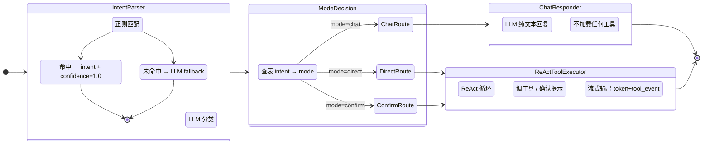
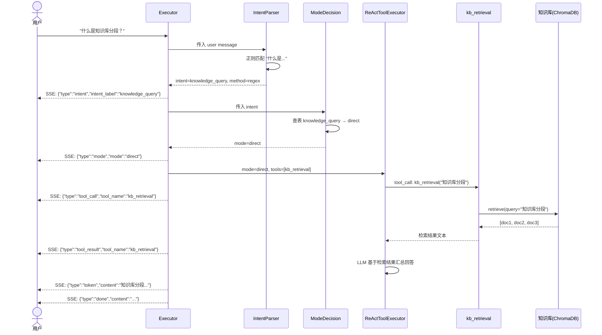
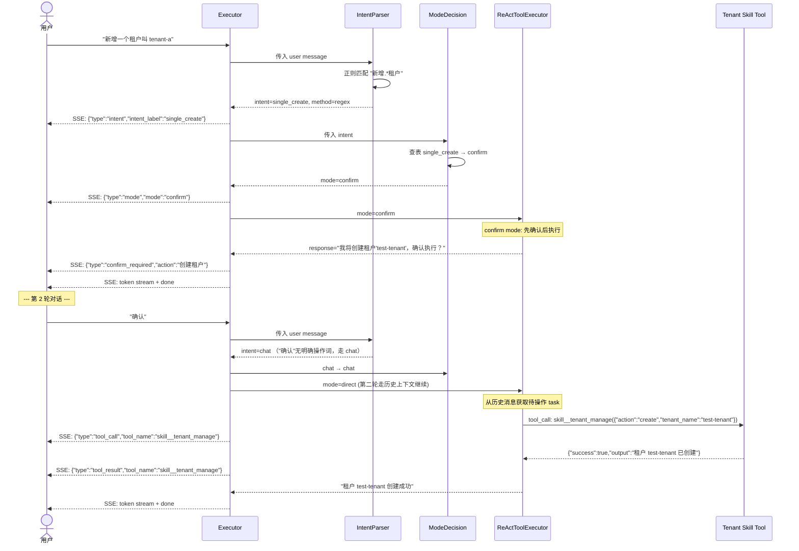

# 观心 v2 Agent 架构升级技术方案

> 版本：v2.0 / 日期：2026-08-20 / 状态：Implemented / 作者：架构师 高见远

> 2026-08-20 实施说明：本文后续章节保留最初的演进设计作为决策记录。当前实现已进一步升级为持久化线性工作流：DeepSeek Planner 生成最多 16 步计划，LangGraph 通过 `interrupt()` / `Command(resume=...)` 暂停恢复，业务状态与 checkpoint 分别保存在两份 SQLite 中。单步写操作也走该引擎；旧的 prompt 确认方案不再用于新请求。现行运行时设计以 [`docs/architecture.md`](./architecture.md) 为准。

---

## 1. 设计总览

### 1.1 从 create_react_agent 到自定义 StateGraph

当前 Agent 是 `langgraph.prebuilt.create_react_agent` 的黑盒包装，所有决策权交给 LLM 在单次 ReAct 循环中完成。升级后采用自定义 `StateGraph`，将"意图分类 → 模式决策 → 执行"拆分为独立节点，让每层有可观测、可调试的逻辑。

```
旧架构（当前）：
  START → [create_react_agent(LM+Tools)] → END

新架构（升级后）：
  START → IntentParser → ModeDecision
              ├─ mode=chat ─→ ChatResponder ───→ END
              └─ mode=direct/confirm → ReActToolExecutor → END
```

### 1.2 设计原则

| 原则 | 说明 |
|------|------|
| **兼容优先** | `AGENT_MODE=legacy` 可一键切回旧版 create_react_agent |
| **低延迟优先** | 意图分类先走正则（0ms），未命中才走 LLM（~500ms） |
| **渐进增强** | P0 仅 chat/direct/confirm 三种模式，P1 再加 form/multi_step |
| **复用现有能力** | ReActToolExecutor 复用现有 `astream_events` SSE 流式机制 |
| **工具可插拔** | Skill 和 MCP 工具独立注册，支持运行时动态发现 |

---

## 2. StateGraph 节点设计

### 2.1 AgentState 完整定义

Python TypedDict，分四组子状态，兼容 LangGraph StateGraph 的 Annotation-based 状态更新。

```python
# 文件: backend/app/agent/state.py (新建)

from typing import Annotated, TypedDict, Sequence
from langchain_core.messages import BaseMessage
from langgraph.graph.message import add_messages


class IntentSubState(TypedDict):
    """意图分类结果子状态"""
    intent_label: str          # 意图标签（IntentEnum 值之一）
    confidence: float          # 置信度 0.0~1.0
    method: str                # 分类方法："regex" | "llm"
    entities: dict             # 提取的实体，如 {"target": "租户", "name": "tenant-a"}


class ContextSubState(TypedDict):
    """执行上下文子状态"""
    tenant_id: str
    user_id: str
    conversation_id: str
    agent_id: str


class ToolsSubState(TypedDict):
    """工具相关子状态"""
    enabled_tool_names: list[str]       # 用户配置启用的工具名列表
    available_tools: list[dict]         # 运行时可用工具元数据（动态更新）


class AgentState(TypedDict):
    """Agent 主状态，用于 StateGraph 生命周期"""
    # 消息列表（LangGraph add_messages reducer 自动合并）
    messages: Annotated[Sequence[BaseMessage], add_messages]

    # 子状态分组
    intent: IntentSubState              # 意图分类结果
    context: ContextSubState            # 执行上下文
    tools_state: ToolsSubState          # 工具状态

    # 顶层路由键
    mode: str                           # 交互模式："chat" | "direct" | "confirm"
    confirmed: bool                     # confirm 模式下用户是否已确认

    # 输出
    final_response: str                 # 最终回复文本
```

**设计说明**：

- `messages` 使用 LangGraph 的 `add_messages` reducer，无需手动管理消息追加
- 子状态用 TypedDict 分组，语义清晰，但 LangGraph 内部以 平铺 key 方式更新（eg. `{"intent": {"intent_label": "chat", ...}}`）
- `mode` 是顶层路由键，由 ModeDecision 节点写入，条件边据此路由

### 2.2 IntentParser 节点 — 意图分类

#### 2.2.1 正则规则表（P0 硬编码，≤20 条）

规则按优先级从高到低顺序匹配，第一条命中即返回。格式：`(regex, intent, entities_extractor)`。

```python
# 文件: backend/app/agent/nodes/intent_parser.py (新建)

INTENT_REGEX_RULES: list[tuple[str, str, dict | None]] = [
    # --- 第 0 层：闲聊、打招呼（最高优先级）---
    (r"^(你好|hi|hello|嗨|早上好|晚上好|下午好|好久不见|在吗|嘿|hello there)\b", "chat", None),

    # --- 第 1 层：知识类问句 ---
    (r"(什么是|什么叫|啥是|介绍.*一下|.*是什么概念|.*是什么意思|.*的定义)", "knowledge_query", None),
    (r"(知识库|知识.*文档|上传.*文档).*(怎么|如何|怎样)", "knowledge_query", None),

    # --- 第 2 层：数据查询 ---
    (r"(查询|查看|列出|显示|有哪些|搜索|检索|找一下).*(租户|用户|账号|权限|角色|日志|任务)", "data_query", None),
    (r"^(查|搜).*(租户|用户|列表)", "data_query", None),

    # --- 第 3 层：单条 CRUD ---
    (r"(新增|创建|添加|新建|开通|注册).*(租户|用户|账号|项目|空间)", "single_create", None),
    (r"(修改|更新|编辑|更改|重命名|调整|配置).*(租户|用户|账号|项目|设置)", "single_update", None),
    (r"(删除|移除|注销|停用|禁用|清理).*(租户|用户|账号|项目)", "single_delete", None),

    # --- 第 4 层：批量操作 ---
    (r"(批量|导入|导出|迁移|同步|全部.*升级|全部.*更新)", "batch_operation", None),

    # --- 第 5 层：系统诊断 ---
    (r"(系统.*慢|为什么.*慢|排查|诊断|性能|日志.*报错|看.*日志|检查.*状态)", "system_diagnosis", None),

    # --- 第 6 层：工单 ---
    (r"(工单|报错|故障|bug|问题反馈|提个.*issue|提交.*问题)", "ticket_submit", None),

    # --- 第 7 层：多步流程 ---
    (r"(帮.*所有|升级.*套餐|执行.*步骤|依次|逐个|逐步)", "multi_step_flow", None),
]
```

#### 2.2.2 节点逻辑

```
IntentParser 执行流程:
  1. 从 state["messages"] 获取最后一条 HumanMessage content
  2. 遍历 INTENT_REGEX_RULES（优先级从高到低）
     ├─ 命中 → 返回 {"intent": {"intent_label": "X", "confidence": 1.0, "method": "regex"}}
     └─ 未命中 → 继续
  3. 所有正则未命中 → 调用 LLM 分类（低成本模型，单 token 输出）
     ├─ Prompt: "Classify user intent: {message} → one of [chat/knowledge_query/data_query/...]"
     └─ 返回 {"intent": {"intent_label": "X", "confidence": 0.7~0.9, "method": "llm"}}
```

#### 2.2.3 LLM Fallback Prompt

```python
INTENT_CLASSIFICATION_PROMPT = """你是意图分类器。根据用户消息，输出单一意图标签（不要解释）。

可选意图：chat, knowledge_query, data_query, single_create, single_update,
          single_delete, batch_operation, multi_step_flow, system_diagnosis, ticket_submit

用户消息：{user_message}

意图标签："""
```

**关键设计点**：
- LLM 分类仅输出标签名（单 token），延迟 ~200ms，成本极低
- 正则命中率预计 > 80%（Demo 阶段用户输入偏向明确指令），LLM 仅在 20% 模糊场景触发

### 2.3 ModeDecision 节点 — 模式决策

#### 2.3.1 意图 → 模式映射表

```python
# 文件: backend/app/agent/nodes/mode_decision.py (新建)

INTENT_TO_MODE: dict[str, str] = {
    "chat":               "chat",
    "knowledge_query":    "direct",     # 静默执行 kb_retrieval + 汇总
    "data_query":         "direct",     # 静默执行查询工具
    "single_create":      "confirm",    # 需用户确认
    "single_update":      "confirm",    # 需用户确认
    "single_delete":      "confirm",    # 需用户确认
    "batch_operation":    "confirm",    # 批量操作需确认
    "multi_step_flow":    "direct",     # P0 简化为 ReAct 子 Agent，无需 confirm
    "system_diagnosis":   "direct",     # 诊断直接执行
    "ticket_submit":      "confirm",    # 提交工单需确认
}
```

#### 2.3.2 节点逻辑

```
ModeDecision 执行流程:
  1. 从 state["intent"]["intent_label"] 读取意图
  2. 查表 INTENT_TO_MODE 获取 mode
  3. 返回 {"mode": "<mode_value>"}
  4. （P1 扩展：single_create 检查参数完整度 → 参数不全可能映射为 form）
```

### 2.4 ChatResponder 节点 — 聊天回复

**职责**：处理 `mode=chat` 的闲聊/问候场景，直接 LLM 回复，不加载任何工具。

```python
# 文件: backend/app/agent/nodes/chat_responder.py (新建)

def create_chat_responder_node(llm: ChatOpenAI, system_prompt: str):
    """
    返回异步节点函数，输入 AgentState，输出 AgentState 更新。

    执行逻辑:
      1. 使用 system_prompt + messages 列表调用 LLM（不带 tool）
      2. LLM 流式输出文本（通过 langgraph stream_mode）
      3. 返回 {"final_response": llm_response, "messages": [AIMessage(response)]}
    """
```

**与现有区别**：
- 旧版：create_react_agent 给 LLM 注入全部工具，闲聊也可能触发 tool_call
- 新版：ChatResponder 不传 tools，LLM 仅做纯文本回复，节省 tokens + 避免误触发

### 2.5 ReActToolExecutor 节点 — 工具执行

**职责**：处理 `mode=direct` 或 `mode=confirm` 场景，复用现有 ReAct 循环能力（astream_events）。

```python
# 文件: backend/app/agent/nodes/react_executor.py (新建)

def create_react_executor_node(llm: ChatOpenAI, tools: list, mode: str):
    """
    返回异步节点函数。

    执行逻辑:
      1. 根据 mode 动态构建 system_prompt:
         - mode=direct: 标准 ReAct prompt（分析 → 调工具 → 汇总）
         - mode=confirm: 标准 prompt + "对于创建/修改/删除类操作，先向用户确认后再执行"
      2. 调用 langgraph.prebuilt.create_react_agent 或手动 ReAct 循环
      3. 通过 astream_events 流式输出 token / tool_call / tool_result
      4. 返回 {"final_response": result, "messages": [...]}
    """
```

**关键设计决定**：

ReActToolExecutor 内部仍可使用 `create_react_agent`（作为子图），因为 P0 不需要自定义 ReAct 循环——我们只是在它之上加了意图分类和模式决策。这最大限度复用现有能力，降低改动风险。

**confirm 模式的处理**：

在 P0 中，confirm 模式通过 ReAct 子 Agent 的 system prompt 实现：
- Prompt 指示 LLM："对于需要数据变更的操作，先输出确认信息，等待用户回复'确认'后再调用工具"
- 用户下一轮消息"确认"会走入 IntentParser → chat → ChatResponder（回复已执行）... 

由于 LangGraph 当前不支持 Interrupt 机制在 P0 阶段使用，confirm 模式实际上是**两轮对话**：
1. 第 1 轮：Agent 输出"我将执行 XXX，请确认（回复'确认'或'取消'）"
2. 第 2 轮：用户在后续消息中回复"确认"，Agent 重新进入 IntentParser

**更优方案（推荐）**：confirm 模式下，ReActToolExecutor 内部使用 **两步 ReAct**：第一步生成确认问题但不调工具；收到确认信号后第二步才暴露工具。实现上可通过 has_confirm 状态位控制。

### 2.6 条件路由边

```python
def route_after_mode_decision(state: AgentState) -> str:
    """ModeDecision → ChatResponder / ReActToolExecutor 路由"""
    mode = state.get("mode", "chat")
    if mode == "chat":
        return "chat_responder"
    else:
        return "react_executor"
```

完整的图构建代码：

```python
# 文件: backend/app/agent/graph.py (重写)

from langgraph.graph import StateGraph, START, END
from app.agent.state import AgentState

def create_state_graph_agent(llm, tools, system_prompt: str):
    """构建自定义 StateGraph Agent"""
    
    workflow = StateGraph(AgentState)

    # 1. 注册节点
    workflow.add_node("intent_parser", create_intent_parser_node(llm))
    workflow.add_node("mode_decision", create_mode_decision_node())
    workflow.add_node("chat_responder", create_chat_responder_node(llm, system_prompt))
    workflow.add_node("react_executor", create_react_executor_node(llm, tools))

    # 2. 注册边
    workflow.add_edge(START, "intent_parser")
    workflow.add_edge("intent_parser", "mode_decision")

    # 3. 条件路由
    workflow.add_conditional_edges(
        "mode_decision",
        route_after_mode_decision,
        {
            "chat_responder": "chat_responder",
            "react_executor": "react_executor",
        }
    )

    workflow.add_edge("chat_responder", END)
    workflow.add_edge("react_executor", END)

    return workflow.compile()
```

---

## 3. Mermaid 状态图（StateGraph 完整流程）



---

## 4. 文件变更清单

### 4.1 修改文件

| 文件 | 变更内容 | 影响 |
|------|---------|------|
| `backend/app/agent/graph.py` | 重写：新增 `create_state_graph_agent()`，保留旧函数为 `create_legacy_agent()`。入口函数 `create_agent()` 根据 `AGENT_MODE` 分发 | 核心变更 |
| `backend/app/agent/executor.py` | 适配新 StateGraph：支持新 SSE 事件（intent/mode），`AGENT_MODE` 分发 | 中等 |
| `backend/app/agent/tools.py` | 重构 `get_tools()`：返回 Skill tools + MCP tools + kb_retrieval。每个 Skill 独立注册为 tool | 核心变更 |
| `backend/app/agent/prompts.py` | 新增：意图分类 LLM fallback prompt、ReAct 子 Agent 的 confirm mode prompt | 中等 |
| `backend/app/mcp/client.py` | 新增方法：`get_tool_definitions()` 返回适配 LangChain tool 格式的工具定义列表 | 小 |
| `backend/app/config.py` | 新增配置项：`agent_mode: str = "state_graph"`（支持 "state_graph" / "legacy"） | 小 |

### 4.2 新增文件

| 文件 | 内容 | 优先级 |
|------|------|--------|
| `backend/app/agent/state.py` | AgentState TypedDict + IntentEnum + ModeEnum | P0 |
| `backend/app/agent/nodes/__init__.py` | 节点包初始化 | P0 |
| `backend/app/agent/nodes/intent_parser.py` | IntentParser 节点 + 正则规则表 | P0 |
| `backend/app/agent/nodes/mode_decision.py` | ModeDecision 节点 + intent→mode 映射表 | P0 |
| `backend/app/agent/nodes/chat_responder.py` | ChatResponder 节点 | P0 |
| `backend/app/agent/nodes/react_executor.py` | ReActToolExecutor 节点 | P0 |

### 4.3 废弃（保留但不主动使用）

| 文件/函数 | 说明 |
|-----------|------|
| `graph.py::create_agent_graph()` | 重命名为 `create_legacy_agent()`，由 `AGENT_MODE=legacy` 触发 |
| `tools.py::skill_execute_tool_factory()` | 统一 `skill_execute` 被每个 Skill 独立 tool 替代，保留兼容 |

---

## 5. 数据流与接口

### 5.1 AgentState 类型定义

详见 2.1 节，`backend/app/agent/state.py` 中定义。

### 5.2 意图枚举

```python
# 文件: backend/app/agent/state.py

from enum import StrEnum

class IntentEnum(StrEnum):
    CHAT = "chat"                             # 闲聊/问候
    KNOWLEDGE_QUERY = "knowledge_query"       # 知识库问答
    DATA_QUERY = "data_query"                 # 数据查询
    SINGLE_CREATE = "single_create"           # 单条创建
    SINGLE_UPDATE = "single_update"           # 单条更新
    SINGLE_DELETE = "single_delete"           # 单条删除
    BATCH_OPERATION = "batch_operation"       # 批量操作
    MULTI_STEP_FLOW = "multi_step_flow"       # 多步流程
    SYSTEM_DIAGNOSIS = "system_diagnosis"     # 系统诊断
    TICKET_SUBMIT = "ticket_submit"           # 工单提报
```

### 5.3 模式枚举

```python
# 文件: backend/app/agent/state.py

class ModeEnum(StrEnum):
    CHAT = "chat"           # 自由对话，无工具调用
    DIRECT = "direct"       # 直接执行工具
    CONFIRM = "confirm"     # 需用户确认后执行
    # P1 扩展:
    # FORM = "form"         # 弹表单补全参数
    # MULTI_STEP = "multi_step"  # 多步编排
```

### 5.4 get_tools() 新签名

```python
# 文件: backend/app/agent/tools.py (重构后)

def get_tools(
    enabled_names: list[str] | None = None,
    include_skills: bool = True,
    include_mcp: bool = True,
) -> list:
    """获取 Agent 工具列表。

    Args:
        enabled_names: 用户配置启用的工具名列表，None=全部启用
        include_skills: 是否包含 Skill 工具
        include_mcp: 是否包含 MCP 工具

    Returns:
        LangChain Tool 对象列表，包含：
        1. kb_retrieval — 知识库检索
        2. skill__<skill_name> — 每个注册 Skill 的独立 tool
        3. mcp__<server>__<tool_name> — 每个 MCP Server 暴露的工具
    """
    tools = [kb_retrieval_tool_factory()]

    if include_skills:
        from app.skills.registry import get_skill_registry
        registry = get_skill_registry()
        for skill in registry.list_skills():
            tools.append(skill.as_langchain_tool())  # Skill 基类需实现此方法

    if include_mcp:
        from app.mcp.client import get_mcp_client
        mcp_client = get_mcp_client()
        for server_name, conn in mcp_client._connections.items():
            for mcp_tool in conn["tools"]:
                tools.append(create_mcp_langchain_tool(server_name, mcp_tool))

    if enabled_names:
        tools = [t for t in tools if t.name in enabled_names]

    return tools
```

### 5.5 SSE 事件协议变更

#### 现有事件（保持不变，向下兼容）

| type | 内容 | 保持 |
|------|------|------|
| `token` | `{"type": "token", "content": "..."}` | 不变 |
| `tool_call` | `{"type": "tool_call", "tool_name": "...", "tool_input": "..."}` | 不变 |
| `tool_result` | `{"type": "tool_result", "tool_name": "...", "tool_output": "..."}` | 不变 |
| `a2ui` | `{"type": "a2ui", "schema": {...}}` | 不变 |
| `done` | `{"type": "done", "content": "..."}` | 不变 |
| `error` | `{"type": "error", "content": "..."}` | 不变 |

#### 新增事件（可选消费，前端可忽略）

| type | 内容 | 说明 |
|------|------|------|
| `intent` | `{"type": "intent", "intent_label": "single_create", "confidence": 1.0, "method": "regex"}` | 意图分类结果，前端可用于调试面板展示 |
| `mode` | `{"type": "mode", "mode": "confirm"}` | 模式决策结果 |
| `confirm_required` | `{"type": "confirm_required", "action": "创建租户", "entities": {"name": "新租户"}}` | confirm 模式下的确认提示卡片 |

#### executor.py 适配要点

```python
# 文件: backend/app/agent/executor.py (修改后)

async def execute_agent(...):
    if settings.agent_mode == "legacy":
        async for msg in _execute_legacy(...):
            yield msg
    else:
        async for msg in _execute_state_graph(...):
            yield msg

async def _execute_state_graph(state: AgentState, graph, ...):
    """执行自定义 StateGraph，流式输出。

    在 IntentParser 和 ModeDecision 节点中填充 state 后，
    进入 ChatResponder / ReActToolExecutor，通过 astream_events
    输出 token / tool_call / tool_result SSE 事件。
    """
    # 发送 intent 事件（供前端调试）
    yield format_sse({"type": "intent", ...str(state["intent"])})

    # 发送 mode 事件
    yield format_sse({"type": "mode", "mode": state["mode"]})

    # 流式执行后续节点
    async for event in graph.astream_events({"messages": state["messages"]}, version="v2"):
        # ... 复用现有 event 处理逻辑 ...
        pass
```

---

## 6. Mermaid 时序图

### 6.1 "什么是知识库"完整路径



**路径总结**：

```
用户输入 → 正则命中 → knowledge_query → direct → ReAct → kb_retrieval → LLM 汇总 → 流式输出
```

### 6.2 "新增租户"完整路径



**路径总结**：

```
用户输入 → 正则命中 → single_create → confirm → ReAct
  ├─ 第 1 轮：输出确认提示（不调工具）
  └─ 第 2 轮：用户确认 → chat → direct → ReAct → skill__tenant_manage → 返回结果
```

> **设计说明**：P0 的 confirm 模式依赖两轮对话实现。第二轮用户消息"确认"会经 IntentParser 分类为 chat，但 ReAct 子 Agent 从对话历史中还原第一轮的待操作任务并执行。P1 将引入 interrupt/resume 机制实现单轮确认。

---

## 7. 任务列表

### T01：AgentState 类型系统 + 配置项

| 维度 | 内容 |
|------|------|
| **对应需求** | UP-004（基础设施） |
| **描述** | 定义 AgentState TypedDict、IntentEnum、ModeEnum、在 config.py 添加 agent_mode 配置项 |
| **涉及文件** | `agent/state.py`（新建）、`config.py`（修改） |
| **依赖** | 无 |
| **产出** | AgentState 完整类型定义 + IntentEnum + ModeEnum + `AGENT_MODE` 环境变量 |
| **验收** | 类型文件可 import 无报错；`settings.agent_mode` 默认值为 "state_graph"，设为 "legacy" 后生效 |

### T02：IntentParser + ModeDecision 节点

| 维度 | 内容 |
|------|------|
| **对应需求** | UP-001（意图分类）、UP-002（模式决策） |
| **描述** | 实现 IntentParser 节点（正则规则表 + LLM fallback）+ ModeDecision 节点（intent→mode 映射表） |
| **涉及文件** | `agent/nodes/intent_parser.py`（新建）、`agent/nodes/mode_decision.py`（新建）、`agent/prompts.py`（修改：添加意图分类 prompt） |
| **依赖** | T01 |
| **产出** | 两个可独立测试的节点函数 |
| **验收** | 单元测试 10 种意图各 3 条测试语料全部命中正确意图；未匹配语料走 LLM fallback |

**实现顺序**：
1. 先在 `agent/prompts.py` 添加 `INTENT_CLASSIFICATION_PROMPT`
2. 创建 `intent_parser.py`，定义 `INTENT_REGEX_RULES` 和 `create_intent_parser_node(llm)`
3. 创建 `mode_decision.py`，定义 `INTENT_TO_MODE` 和 `create_mode_decision_node()`
4. 本地单元测试验证

### T03：ChatResponder + ReActToolExecutor 节点

| 维度 | 内容 |
|------|------|
| **对应需求** | UP-004（自定义 StateGraph） |
| **描述** | 实现 ChatResponder 节点（纯 LLM 调用，无工具）+ ReActToolExecutor 节点（ReAct 循环 + astream_events） |
| **涉及文件** | `agent/nodes/chat_responder.py`（新建）、`agent/nodes/react_executor.py`（新建） |
| **依赖** | T02 |
| **产出** | 两个可独立测试的节点函数 |
| **验收** | ChatResponder 不调任何工具输出回复；ReActToolExecutor 可调 kb_retrieval 并流式输出 token/tool_call/tool_result |

**实现顺序**：
1. 实现 `chat_responder.py`：`create_chat_responder_node(llm, system_prompt)` → 调用 LLM 无 tools
2. 实现 `react_executor.py`：`create_react_executor_node(llm, tools, mode)` → 调用 create_react_agent 子图
3. 确认 SSE 流式事件（token/tool_call/tool_result）在 `executor.py` 中可正确捕获

### T04：工具注册增强（Skill + MCP 独立注册）

| 维度 | 内容 |
|------|------|
| **对应需求** | UP-003（工具注册增强） |
| **描述** | 重构 `get_tools()`，注册每个 Skill 为独立 tool，注册所有已连接 MCP Server 工具 |
| **涉及文件** | `agent/tools.py`（重构）、`mcp/client.py`（修改：新增 `get_tool_definitions()`）、`skills/base.py`（可能需添加 `as_langchain_tool()` 方法） |
| **依赖** | T01 |
| **产出** | `get_tools()` 返回包含 Skill tools + MCP tools + kb_retrieval 的完整工具列表 |
| **验收** | `get_tools()` 返回的工具列表中每个 Skill 有独立 tool（如 `skill__tenant_manage`），MCP 连接后对应工具出现 |

**实现顺序**：
1. 在 `mcp/client.py` 添加 `get_tool_definitions()` 方法，返回可用于 LangChain tool 的工具定义
2. 检查 `skills/base.py` 的 `BaseSkill`，添加 `as_langchain_tool()` 抽象方法
3. 重构 `tools.py` 的 `get_tools()`，包含 Skill + MCP 工具
4. 确保 kb_retrieval 仍正常注册

### T05：StateGraph 组装 + Executor 适配 + Legacy 兼容

| 维度 | 内容 |
|------|------|
| **对应需求** | UP-004（自定义 StateGraph） |
| **描述** | 组装 StateGraph（节点+边+路由），适配 executor 支持新 SSE 事件和 legacy 模式分发 |
| **涉及文件** | `agent/graph.py`（重写）、`agent/executor.py`（修改）、`agent/nodes/__init__.py`（新建） |
| **依赖** | T02、T03、T04 |
| **产出** | 完整的自定义 StateGraph Agent，支持 legacy 回退，SSE 事件完整 |
| **验收** | 6 个 P0 场景全部通过（SC-01 到 SC-06）；`AGENT_MODE=legacy` 切回旧版功能不变 |

**实现顺序**：
1. 重写 `graph.py`：组装 StateGraph，注册 4 个节点 + 条件边
2. 修改 `executor.py`：根据 `settings.agent_mode` 分发，新增 intent/mode SSE 事件发送
3. 确保 astream_events 在自定义 StateGraph 中正确流转
4. 保留 `create_agent_graph()` 为 `create_legacy_agent()`，legacy 模式调用它
5. 端到端测试 6 个 P0 场景

### 依赖关系图

```
T01 (AgentState 类型)
 ├─→ T02 (IntentParser + ModeDecision)
 │    └─→ T03 (ChatResponder + ReActToolExecutor)
 │         └─→ T05 (StateGraph 组装)
 └─→ T04 (工具注册增强)
      └─→ T05 ↗
```

---

## 8. 共享知识

### 8.1 命名约定

| 类别 | 约定 | 示例 |
|------|------|------|
| **Tool 名称前缀** | `skill__` 前缀标识 Skill tool<br>`mcp__` 前缀标识 MCP tool | `skill__tenant_manage`、`mcp__weather__get_forecast` |
| **节点函数** | `create_xxx_node(llm, ...)` 工厂函数返回 async callable | `create_intent_parser_node(llm)` |
| **节点文件** | 一个节点一个文件，放在 `agent/nodes/` | `agent/nodes/intent_parser.py` |
| **枚举值** | 使用 `snake_case`，通过 `StrEnum` 导出 | `IntentEnum.KNOWLEDGE_QUERY` |
| **配置项** | `agent_mode`：`"state_graph"` / `"legacy"` | `AGENT_MODE=state_graph` |

### 8.2 正则规则格式

```python
# 格式: (正则表达式字符串, 意图标签, 实体提取器字典或 None)
# 规则按列表顺序匹配，第一条命中即返回

INTENT_REGEX_RULES = [
    (r"^(你好|hi|hello)", "chat", None),
    # ...
]
```

- 正则使用 `re.IGNORECASE` 忽略大小写
- 实体提取器（`entities_extractor`）预留字段，P0 不实现（均填 `None`）
- P1 可改为从配置文件加载（YAML/JSON）

### 8.3 Skill 工具注册规范

每个 Skill 需在 `BaseSkill` 基类中实现 `as_langchain_tool()` 方法：

```python
# 预期在 skills/base.py 中新增

class BaseSkill:
    def as_langchain_tool(self) -> BaseTool:
        """将 Skill 转为 LangChain Tool 对象。

        tool_name 格式: skill__<skill_name>
        tool_description: skill 的 description 字段
        tool_function: 封装 execute() 调用
        """
        raise NotImplementedError
```

### 8.4 AGENT_MODE 环境变量

```bash
# 使用新架构（默认）
AGENT_MODE=state_graph

# 回退到旧的 create_react_agent
AGENT_MODE=legacy
```

在 `config.py` 中：

```python
agent_mode: str = "state_graph"  # "state_graph" | "legacy"
```

在 `executor.py` 中的分发逻辑：

```python
if settings.agent_mode == "legacy":
    agent = create_legacy_agent(...)
else:
    agent = create_state_graph_agent(...)
```

### 8.5 confirm 模式多轮约定

P0 阶段 confirm 模式通过对话历史承载待操作任务：
- 第一轮：Agent 输出确认问题 + 将待执行操作序列化到对话上下文中
- 第二轮：用户回复"确认"后，ReAct 子 Agent 从历史中还原待执行任务并执行

这与正式产品中的 interrupt/checkpoint 机制有别，但满足 Demo 验收标准。

### 8.6 测试约定

- **单元测试**：IntentParser 正则规则测试（`tests/test_intent_parser.py`）覆盖所有规则
- **集成测试**：StateGraph 端到端测试（`tests/test_state_graph.py`）覆盖 6 个 P0 场景
- **回归测试**：`AGENT_MODE=legacy` 确保旧功能不受影响

---

## 附录 A：10 种意图 × 示例语料速查

| 意图 | 正则 | 示例语料 | 预期路径 |
|------|------|---------|---------|
| `chat` | `^(你好\|hi\|hello\|嗨)` | "你好啊"、"Hi there" | chat → ChatResponder |
| `knowledge_query` | `(什么是\|什么叫\|...)` | "什么是知识库分段"、"RAG 是什么意思" | direct → kb_retrieval |
| `data_query` | `(查询\|查看\|列出\|...).*` | "查一下所有租户列表"、"显示当前用户" | direct → query tool |
| `single_create` | `(新增\|创建\|添加\|...).*` | "新增一个租户test"、"添加用户张三" | confirm → create tool |
| `single_update` | `(修改\|更新\|编辑\|...).*` | "修改tenant-a的名称"、"更新配置" | confirm → update tool |
| `single_delete` | `(删除\|移除\|注销\|...).*` | "删除租户test"、"移除用户李四" | confirm → delete tool |
| `batch_operation` | `(批量\|导入\|导出\|...).*` | "批量导入100个租户"、"导出数据" | confirm → batch tool |
| `multi_step_flow` | `(帮.*所有\|升级.*套餐\|...)*` | "给所有活跃租户升级套餐" | direct → ReAct 子 Agent |
| `system_diagnosis` | `(系统.*慢\|为什么.*慢\|诊断\|...)*` | "系统为什么慢了"、"诊断一下性能" | direct → diag tools |
| `ticket_submit` | `(工单\|报错\|故障\|bug\|...)*` | "帮我提个工单"、"提交一个问题" | confirm → ticket tool |

---

*本文档为 Draft 状态。下一步交由开发团队（pm-agent / software-product-manager-2）进行代码实现。*
