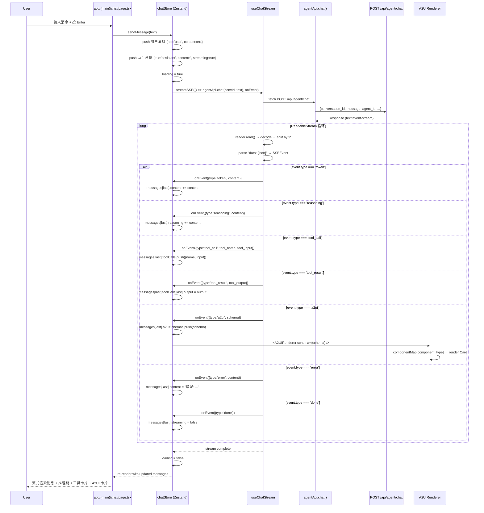
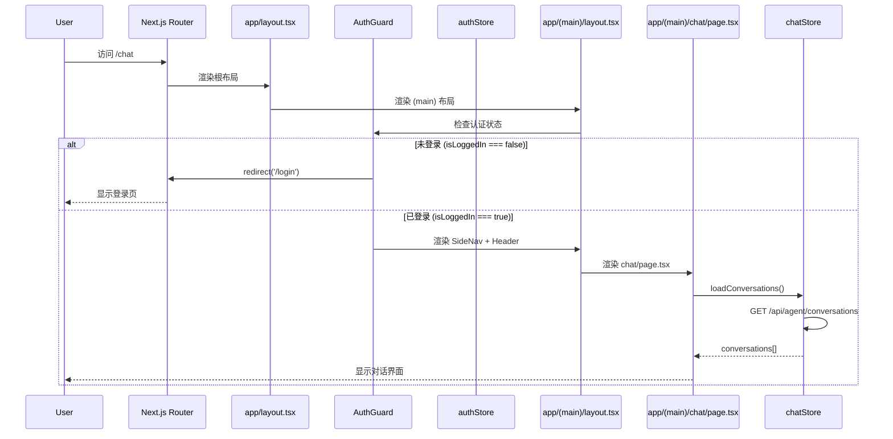
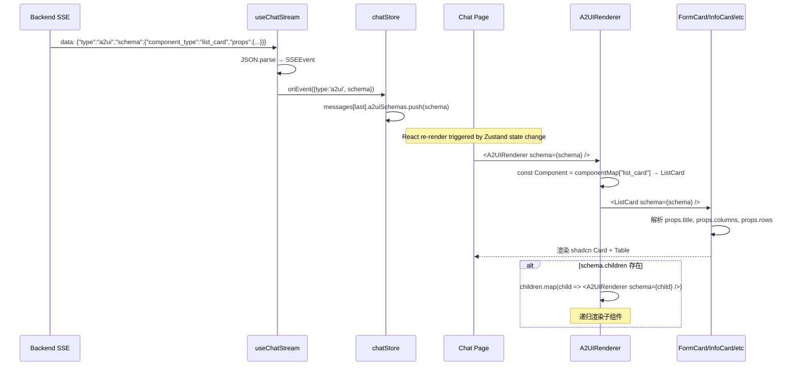
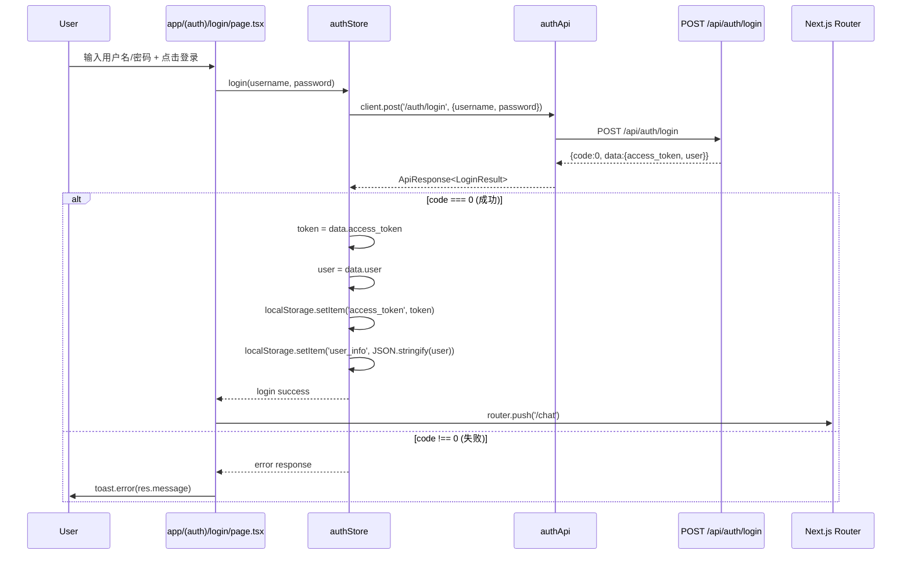
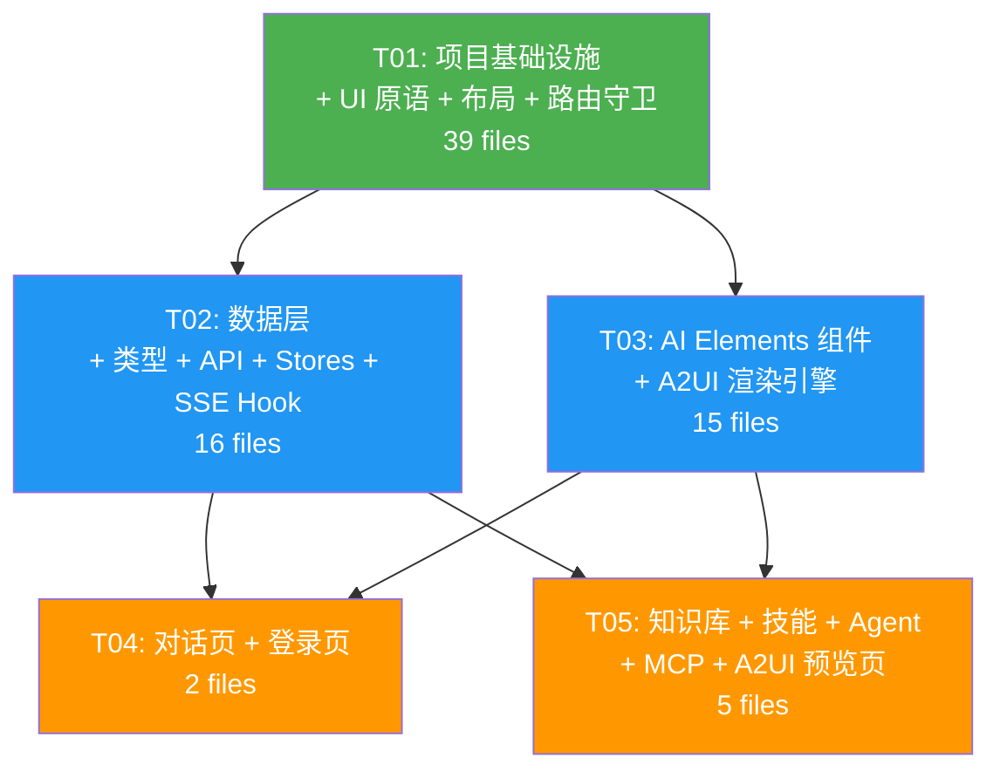

# 观心 v2 前端架构设计：React 19 + Next.js + AI Elements + shadcn/ui

> 版本：v2.0-frontend-react-architecture
> 日期：2026-07-13
> 状态：Ready for Implementation
> 作者：架构师 高见远
> 关联文档：[prd-frontend-react-migration.md](./prd-frontend-react-migration.md) | [architecture.md](./architecture.md)

---

## 目录

1. [技术栈确认](#1-技术栈确认)
2. [实现方案](#2-实现方案)
3. [文件列表](#3-文件列表)
4. [数据结构与接口](#4-数据结构与接口)
5. [程序调用流程](#5-程序调用流程)
6. [待明确事项](#6-待明确事项)
7. [依赖包列表](#7-依赖包列表)
8. [任务列表](#8-任务列表)
9. [共享知识](#9-共享知识)
10. [任务依赖图](#10-任务依赖图)

---

## 1. 技术栈确认

### 1.1 框架与核心库

| 类别 | 库 | 版本 | 用途 |
|------|-----|------|------|
| 框架 | react | ^19.0.0 | UI 框架 |
| 元框架 | next | ^15.1.0 | App Router 文件路由 |
| 语言 | typescript | ~5.7.0 | 类型安全 |
| UI 组件库 | shadcn/ui (copy-paste) | - | 基于 Radix UI 的可定制组件 |
| CSS 方案 | tailwindcss | ^4.0.0 | 原子化 CSS + CSS variables |
| 状态管理 | zustand | ^5.0.0 | 轻量状态管理 |
| HTTP 客户端 | axios | ^1.7.9 | API 请求 + 拦截器 |
| Markdown | react-markdown + remark-gfm + rehype-highlight | latest | 流式 Markdown 渲染 |
| 图表 | recharts | ^2.15.0 | 柱状图/折线图 |
| 图标 | lucide-react | ^0.468.0 | 图标库 |
| 日期 | dayjs | ^1.11.13 | 日期处理 |
| 代码高亮 | rehype-highlight | ^7.0.0 | 代码块语法高亮 |
| 工具函数 | clsx + tailwind-merge | latest | cn() 类名合并 |
| Radix 原语 | @radix-ui/react-* (各组件) | latest | shadcn/ui 底层依赖 |
| 通知 | sonner | ^1.7.0 | Toast 通知（替代 antd message） |

### 1.2 技术选型说明

**为何不使用 Vercel AI SDK 的 `useChat`？**
后端 SSE 事件格式是自定义的 `{ type, content, ... }`（7 种事件类型），与 Vercel AI SDK 的 `data: { text: "..." }` 格式不兼容。适配层会引入不必要的复杂度且可能产生 bug。因此保留 `fetch + ReadableStream` 底层实现，封装为 `useChatStream` React hook。

**为何使用 Next.js App Router 而非 Pages Router？**
App Router 的 `layout.tsx` 天然适配 MainLayout 嵌套布局，Route Groups `(auth)` / `(main)` 可优雅分离登录页和主应用布局。AI Elements 组件库也基于 App Router 设计。

**为何使用 Route Groups 而非条件渲染布局？**
Next.js App Router 的 Route Groups `(auth)` 和 `(main)` 允许不同路由段使用不同 layout，无需在根 layout 中写 `if (pathname === '/login')` 条件判断，更符合框架设计哲学。

---

## 2. 实现方案

### 2.1 核心技术挑战

| 挑战 | 方案 |
|------|------|
| SSE 流式解析与 React 状态同步 | `useChatStream` hook 封装 fetch + ReadableStream，通过 Zustand `set()` 更新消息状态，避免 React 重渲染瓶颈 |
| A2UI Schema 驱动的动态渲染 | `A2UIRenderer` 使用 `component_type → React.Component` Map 分发，递归处理 `children[]` |
| AI Elements 组件与自定义 SSE 协议对接 | AI Elements 组件作为纯展示层，数据来自 Zustand store 的消息结构，不绑定 Vercel AI SDK 协议 |
| Next.js App Router 客户端认证守卫 | `(main)/layout.tsx` 中使用 `AuthGuard` 客户端组件，检查 `useAuthStore` 的 `isLoggedIn`，未登录则 `redirect('/login')` |
| shadcn/ui 复制源码的可维护性 | 按 shadcn/ui 哲学将组件源码复制到 `components/ui/`，通过 CSS variables 统一主题，可自由定制 |

### 2.2 架构模式

采用 **Feature-Based + Layered** 混合架构：

```
┌─────────────────────────────────────────────────────────┐
│                    Next.js App Router                     │
│  app/(auth)/login  |  app/(main)/chat  |  app/(main)/... │
├─────────────────────────────────────────────────────────┤
│                    React Components                       │
│  layout/  |  ai-elements/  |  a2ui/  |  ui/  |  auth/   │
├─────────────────────────────────────────────────────────┤
│                    State + Data Layer                     │
│  Zustand Stores  |  API Client (axios)  |  useChatStream │
├─────────────────────────────────────────────────────────┤
│                    TypeScript Types                       │
│  SSEEvent | A2UISchema | ChatMessage | User | ...        │
└─────────────────────────────────────────────────────────┘
```

- **页面层** (app/): Next.js App Router 文件路由，每个 page.tsx 是一个页面入口
- **组件层** (components/): 按功能域分组 — AI Elements、A2UI、布局、UI 原语、认证
- **数据层** (lib/stores/, lib/api/): Zustand stores 管理状态，axios API 模块封装请求
- **类型层** (types/): 全局 TypeScript 类型定义

### 2.3 SSE 流式处理架构

```
用户输入消息
    │
    ▼
ChatPage → chatStore.sendMessage(text)
    │
    ├── 1. push 用户消息到 messages[]
    ├── 2. push 助手占位消息到 messages[] (streaming: true)
    ├── 3. 调用 useChatStream hook
    │       │
    │       ▼
    │   agentApi.chat(conversationId, text)  ← fetch POST /api/agent/chat
    │       │
    │       ▼
    │   ReadableStream reader.read() 循环
    │       │
    │       ▼
    │   解析 SSE: "data: {json}\n\n" → SSEEvent
    │       │
    │       ▼
    │   onEvent(event) 回调 → chatStore.updateLastMessage()
    │       │
    │       ├── token     → msg.content += event.content
    │       ├── reasoning → msg.reasoning += event.content
    │       ├── tool_call → msg.toolCalls.push({name, input})
    │       ├── tool_result → msg.toolCalls[last].output = event.tool_output
    │       ├── a2ui     → msg.a2uiSchemas.push(event.schema)
    │       ├── error    → msg.content = "错误: ..."
    │       └── done     → msg.streaming = false
    │
    └── 4. finally: loading = false
```

**关键设计**：`useChatStream` 是一个纯函数 hook（不含自身 state），它接收 `onEvent` 回调，回调内部调用 Zustand store 的 `set()` 方法更新消息。这样 SSE 解析逻辑与状态管理解耦。

### 2.4 A2UI 渲染引擎设计

```typescript
// A2UIRenderer.tsx — 分发引擎
const componentMap: Record<string, React.FC<{ schema: A2UISchema }>> = {
  form_card: FormCard,
  info_card: InfoCard,
  list_card: ListCard,
  confirm_card: ConfirmCard,
  chart_card: ChartCard,
}

function A2UIRenderer({ schema }: { schema: A2UISchema }) {
  const Component = componentMap[schema.component_type] ?? InfoCard // fallback
  return (
    <div className="a2ui-renderer">
      <Component schema={schema} />
      {schema.children?.map((child, i) => (
        <A2UIRenderer key={i} schema={child} />
      ))}
    </div>
  )
}
```

### 2.5 AI Elements 集成方案

AI Elements 组件作为 **纯展示层**，数据来自 Zustand store 的消息结构：

| AI Elements 组件 | 数据来源 | 对应 SSE 事件 |
|------------------|---------|--------------|
| `<Conversation>` | chatStore.messages | - (容器) |
| `<Message>` | msg.role, msg.streaming | - (容器) |
| `<Response>` | msg.content | `token` |
| `<Reasoning>` | msg.reasoning | `reasoning` |
| `<Tool>` | msg.toolCalls[] | `tool_call` + `tool_result` |
| `<PromptInput>` | inputText (local state) | - (输入) |
| `<Actions>` | msg (copy/regenerate) | - (操作) |
| `<CodeBlock>` | Response 内部使用 | `token` (代码块) |

### 2.6 认证流程

```
页面访问
    │
    ▼
app/(main)/layout.tsx  ←  包含 AuthGuard
    │
    ▼
AuthGuard (client component)
    │
    ├── useAuthStore.isLoggedIn === false
    │       │
    │       ▼
    │   redirect('/login')
    │
    └── useAuthStore.isLoggedIn === true
            │
            ▼
        渲染 MainLayout (SideNav + Header + children)
```

**JWT 拦截器**（`lib/api/client.ts`）：
- 请求拦截器：从 `localStorage.getItem('access_token')` 读取 token，设置 `Authorization: Bearer {token}`
- 响应拦截器：HTTP 401 时清除 localStorage，`window.location.href = '/login'`

**SSE 请求认证**（`lib/api/agent.ts`）：
- `agentApi.chat()` 使用原生 `fetch`（非 axios），手动从 localStorage 读取 token 设置 Authorization 头

---

## 3. 文件列表

### 3.1 完整目录结构

```
frontend-react/
├── package.json                                    # 依赖声明 + 脚本
├── next.config.ts                                  # Next.js 配置（API 代理）
├── tsconfig.json                                   # TypeScript 配置
├── tailwind.config.ts                              # Tailwind CSS 配置
├── postcss.config.mjs                              # PostCSS 配置
├── components.json                                 # shadcn/ui 配置
├── .env.example                                    # 环境变量示例
├── .env.local                                      # 环境变量（本地）
├── src/
│   ├── app/                                        # Next.js App Router
│   │   ├── layout.tsx                              # 根布局（html/body/Providers）
│   │   ├── page.tsx                                # 首页 → redirect('/chat')
│   │   ├── globals.css                             # 全局样式（Tailwind + CSS variables）
│   │   ├── (auth)/                                 # 认证路由组（无 SideNav）
│   │   │   ├── layout.tsx                          # 认证布局（居中卡片）
│   │   │   └── login/
│   │   │       └── page.tsx                        # 登录页 (M-P0-006)
│   │   └── (main)/                                 # 主应用路由组（有 SideNav + AuthGuard）
│   │       ├── layout.tsx                          # 主布局（AuthGuard + SideNav + Header）
│   │       ├── chat/
│   │       │   └── page.tsx                        # AI 对话页 (M-P0-007~009)
│   │       ├── knowledge/
│   │       │   └── page.tsx                        # 知识库管理页 (M-P0-019)
│   │       ├── skills/
│   │       │   └── page.tsx                        # 技能市场页 (M-P0-020)
│   │       ├── agent/
│   │       │   └── page.tsx                        # Agent 配置页 (M-P0-021)
│   │       ├── mcp/
│   │       │   └── page.tsx                        # MCP 配置页 (M-P0-022)
│   │       └── a2ui/
│   │           └── page.tsx                        # A2UI 预览页 (M-P0-018)
│   ├── components/
│   │   ├── ui/                                     # shadcn/ui 原语（copy-paste）
│   │   │   ├── button.tsx
│   │   │   ├── card.tsx
│   │   │   ├── input.tsx
│   │   │   ├── textarea.tsx
│   │   │   ├── select.tsx
│   │   │   ├── table.tsx
│   │   │   ├── form.tsx
│   │   │   ├── switch.tsx
│   │   │   ├── badge.tsx
│   │   │   ├── avatar.tsx
│   │   │   ├── separator.tsx
│   │   │   ├── scroll-area.tsx
│   │   │   ├── dialog.tsx
│   │   │   ├── label.tsx
│   │   │   ├── slider.tsx
│   │   │   ├── checkbox.tsx
│   │   │   ├── radio-group.tsx
│   │   │   ├── tooltip.tsx
│   │   │   ├── dropdown-menu.tsx
│   │   │   ├── alert.tsx
│   │   │   ├── empty.tsx
│   │   │   └── sonner.tsx                          # Toast 通知
│   │   ├── ai-elements/                            # AI Elements 组件（copy-paste + 定制）
│   │   │   ├── conversation.tsx                    # 对话容器 + 自动滚动
│   │   │   ├── message.tsx                         # 消息气泡 + 头像
│   │   │   ├── response.tsx                        # 流式 Markdown 渲染
│   │   │   ├── prompt-input.tsx                    # 高级输入框
│   │   │   ├── reasoning.tsx                       # 推理过程展示
│   │   │   ├── tool.tsx                            # 工具调用可视化
│   │   │   ├── actions.tsx                         # 消息操作栏
│   │   │   └── code-block.tsx                      # 代码块 + 语法高亮
│   │   ├── a2ui/                                   # A2UI Catalog 渲染组件
│   │   │   ├── A2UIRenderer.tsx                    # 动态渲染引擎 (M-P0-012)
│   │   │   ├── FormCard.tsx                        # 表单卡片 (M-P0-013)
│   │   │   ├── InfoCard.tsx                        # 信息卡片 (M-P0-014)
│   │   │   ├── ListCard.tsx                        # 列表卡片 (M-P0-015)
│   │   │   ├── ConfirmCard.tsx                     # 确认卡片 (M-P0-016)
│   │   │   ├── ChartCard.tsx                       # 图表卡片 (M-P0-017)
│   │   │   └── index.ts                            # 导出聚合
│   │   ├── layout/                                 # 布局组件
│   │   │   ├── SideNav.tsx                         # 侧边导航 (M-P0-003)
│   │   │   └── Header.tsx                          # 顶部导航栏 (M-P0-003)
│   │   └── auth/                                   # 认证组件
│   │       └── AuthGuard.tsx                       # 客户端认证守卫 (M-P0-002)
│   ├── lib/
│   │   ├── api/                                    # API 客户端模块
│   │   │   ├── client.ts                           # axios 实例 + 拦截器 (M-P0-005)
│   │   │   ├── auth.ts                             # 认证 API (M-P0-023)
│   │   │   ├── agent.ts                            # Agent API + SSE fetch (M-P0-023)
│   │   │   ├── knowledge.ts                        # 知识库 API (M-P0-023)
│   │   │   ├── skill.ts                            # Skill API (M-P0-023)
│   │   │   ├── mcp.ts                              # MCP API (M-P0-023)
│   │   │   └── a2ui.ts                             # A2UI API (M-P0-023)
│   │   ├── stores/                                 # Zustand 状态管理
│   │   │   ├── auth.ts                             # 认证状态 (M-P0-004)
│   │   │   ├── chat.ts                             # 对话状态 (M-P0-007/008)
│   │   │   ├── knowledge.ts                        # 知识库状态
│   │   │   ├── skill.ts                            # Skill 状态
│   │   │   ├── agent.ts                            # Agent 配置状态
│   │   │   ├── mcp.ts                              # MCP 状态
│   │   │   └── a2ui.ts                             # A2UI 状态
│   │   ├── hooks/                                  # React Hooks
│   │   │   └── useChatStream.ts                    # SSE 流式处理 (M-P0-008)
│   │   └── utils.ts                                # 工具函数 (cn, formatDate, formatSize)
│   └── types/
│       └── index.ts                                # TypeScript 类型定义 (M-P0-024)
```

### 3.2 文件总数统计

| 目录 | 文件数 | 说明 |
|------|--------|------|
| 项目配置 | 8 | package.json, next.config.ts, tsconfig.json, tailwind.config.ts, postcss.config.mjs, components.json, .env.example, .env.local |
| app/ | 12 | 根布局 + 首页 + 全局样式 + auth 路由组(2) + main 路由组(8) |
| components/ui/ | 20 | shadcn/ui 原语 |
| components/ai-elements/ | 8 | AI Elements 组件 |
| components/a2ui/ | 7 | A2UI 渲染组件 |
| components/layout/ | 2 | 布局组件 |
| components/auth/ | 1 | 认证守卫 |
| lib/api/ | 7 | API 模块 |
| lib/stores/ | 7 | Zustand stores |
| lib/hooks/ | 1 | useChatStream |
| lib/ | 1 | utils.ts |
| types/ | 1 | 类型定义 |
| **总计** | **75** | |

---

## 4. 数据结构与接口

### 4.1 类图

```mermaid
classDiagram
    class SSEEvent {
        +type: 'token' | 'reasoning' | 'tool_call' | 'tool_result' | 'a2ui' | 'done' | 'error'
        +content?: string
        +tool_name?: string
        +tool_input?: string
        +tool_output?: string
        +schema?: A2UISchema
    }

    class A2UISchema {
        +component_type: string
        +props: Record~string, any~
        +children?: A2UISchema[]
    }

    class ChatMessage {
        +role: 'user' | 'assistant' | 'system' | 'tool'
        +content: string
        +reasoning?: string
        +toolCalls?: ToolCall[]
        +a2uiSchemas?: A2UISchema[]
        +streaming?: boolean
    }

    class ToolCall {
        +name: string
        +input: string
        +output?: string
    }

    class User {
        +user_id: string
        +username: string
        +tenant_id: string
        +tenant_name: string
        +role: 'admin' | 'user'
        +display_name: string
        +created_at: string
    }

    class Conversation {
        +conversation_id: string
        +title: string
        +agent_id: string
        +created_at: string
        +updated_at: string
        +message_count?: number
    }

    class Document {
        +doc_id: string
        +tenant_id: string
        +filename: string
        +file_type: string
        +file_size: number
        +title: string
        +status: string
        +chunk_count: number
        +error_message: string
        +created_at: string
        +updated_at: string
    }

    class RetrievalResult {
        +chunk_id: string
        +content: string
        +score: number
        +doc_id: string
        +filename: string
    }

    class SkillMetadata {
        +name: string
        +display_name: string
        +description: string
        +skill_type: string
        +status: string
        +version: string
        +params: SkillParam[]
        +tags: string[]
        +category: string
    }

    class MCPServer {
        +name: string
        +command: string
        +args: string[]
        +env: Record~string, string~
        +description: string
        +status: string
    }

    class ApiResponse~T~ {
        +code: number
        +message: string
        +data: T
    }

    ChatMessage *-- ToolCall : toolCalls[]
    ChatMessage *-- A2UISchema : a2uiSchemas[]
    SSEEvent ..> A2UISchema : schema

    class AuthStore {
        +token: string
        +user: User | null
        +isLoggedIn: boolean
        +isAdmin: boolean
        +login(username, password) Promise
        +logout() void
        +fetchMe() Promise
    }

    class ChatStore {
        +conversations: Conversation[]
        +currentConversationId: string
        +messages: ChatMessage[]
        +loading: boolean
        +loadConversations() Promise
        +createConversation(title) Promise
        +sendMessage(text) Promise
        +selectConversation(id) Promise
        +clearMessages() void
        +deleteConversation(id) Promise
    }

    class KnowledgeStore {
        +documents: Document[]
        +chunks: any[]
        +retrievalResults: RetrievalResult[]
        +loading: boolean
        +loadDocuments() Promise
        +uploadDocument(file, title) Promise
        +deleteDocument(id) Promise
        +retrieve(query, topK) Promise
    }

    class SkillStore {
        +skills: SkillMetadata[]
        +loading: boolean
        +loadSkills() Promise
        +executeSkill(name, params) Promise
    }

    class AgentStore {
        +skills: SkillMetadata[]
        +loading: boolean
        +loadSkills() Promise
    }

    class McpStore {
        +servers: MCPServer[]
        +connections: any[]
        +loading: boolean
        +loadServers() Promise
        +loadConnections() Promise
        +connectServer(name) Promise
        +callTool(server, tool, args) Promise
    }

    class A2uiStore {
        +componentTypes: any[]
        +templates: any[]
        +currentSchema: A2UISchema | null
        +loadCatalog() Promise
        +loadTemplates() Promise
        +setSchema(schema) void
    }

    class UseChatStream {
        +streamSSE(fetchFn, onEvent) Promise
    }

    class A2UIRenderer {
        +componentMap: Record~string, FC~
        +render(schema) JSX
    }

    ChatStore ..> UseChatStream : uses
    ChatStore ..> ChatMessage : manages
    AuthStore ..> User : manages
    ChatStore ..> Conversation : manages
    KnowledgeStore ..> Document : manages
    KnowledgeStore ..> RetrievalResult : manages
    SkillStore ..> SkillMetadata : manages
    A2uiStore ..> A2UISchema : manages
    A2UIRenderer ..> A2UISchema : renders
```



### 4.2 核心类型定义

```typescript
// ============ API 响应 ============
interface ApiResponse<T = any> {
  code: number
  message: string
  data: T
}

// ============ 认证 ============
interface User {
  user_id: string
  username: string
  tenant_id: string
  tenant_name: string
  role: 'admin' | 'user'
  display_name: string
  created_at: string
}

interface LoginResult {
  access_token: string
  token_type: string
  user: User
}

// ============ 对话 ============
interface Conversation {
  conversation_id: string
  title: string
  agent_id: string
  created_at: string
  updated_at: string
  message_count?: number
}

interface ToolCall {
  name: string
  input: string
  output?: string
}

interface ChatMessage {
  role: 'user' | 'assistant' | 'system' | 'tool'
  content: string
  reasoning?: string
  toolCalls?: ToolCall[]
  a2uiSchemas?: A2UISchema[]
  streaming?: boolean
}

// ============ SSE ============
interface SSEEvent {
  type: 'token' | 'reasoning' | 'tool_call' | 'tool_result' | 'a2ui' | 'done' | 'error'
  content?: string
  tool_name?: string
  tool_input?: string
  tool_output?: string
  schema?: A2UISchema
}

// ============ A2UI ============
interface A2UISchema {
  component_type: 'form_card' | 'info_card' | 'list_card' | 'confirm_card' | 'chart_card' | string
  props: Record<string, any>
  children?: A2UISchema[]
}

// ============ 知识库 ============
interface Document {
  doc_id: string
  tenant_id: string
  filename: string
  file_type: string
  file_size: number
  title: string
  status: string
  chunk_count: number
  error_message: string
  created_at: string
  updated_at: string
}

interface RetrievalResult {
  chunk_id: string
  content: string
  score: number
  doc_id: string
  filename: string
}

// ============ Skill ============
interface SkillMetadata {
  name: string
  display_name: string
  description: string
  skill_type: string
  status: string
  version: string
  params: SkillParam[]
  tags: string[]
  category: string
}

interface SkillParam {
  name: string
  type: string
  description: string
  required: boolean
  default?: any
  options?: string[]
}

// ============ MCP ============
interface MCPServer {
  name: string
  command: string
  args: string[]
  env: Record<string, string>
  description: string
  status: string
}
```

### 4.3 Zustand Store 接口定义

#### authStore

```typescript
interface AuthState {
  token: string
  user: User | null
  isLoggedIn: boolean
  isAdmin: boolean
  login: (username: string, password: string) => Promise<ApiResponse<LoginResult>>
  logout: () => void
  fetchMe: () => Promise<void>
}
```

- 初始化时从 `localStorage` 读取 `access_token` 和 `user_info`
- `login()` 成功后写入 `localStorage`
- `logout()` 清除 `localStorage` 并重置 state

#### chatStore

```typescript
interface ChatState {
  conversations: Conversation[]
  currentConversationId: string
  messages: ChatMessage[]
  loading: boolean

  loadConversations: () => Promise<void>
  createConversation: (title?: string) => Promise<Conversation>
  sendMessage: (text: string) => Promise<void>
  selectConversation: (conversationId: string) => Promise<void>
  clearMessages: () => void
  deleteConversation: (conversationId: string) => Promise<void>
}
```

- `sendMessage()` 内部调用 `useChatStream().streamSSE()`
- SSE 事件通过 `set()` 更新 `messages` 数组最后一条消息
- **不可变更新**：Zustand 中必须使用不可变更新（`set(state => ({ messages: [...] }))`），不能直接 mutate

#### knowledgeStore

```typescript
interface KnowledgeState {
  documents: Document[]
  retrievalResults: RetrievalResult[]
  loading: boolean

  loadDocuments: () => Promise<void>
  uploadDocument: (file: File, title?: string) => Promise<void>
  deleteDocument: (docId: string) => Promise<void>
  retrieve: (query: string, topK?: number) => Promise<void>
}
```

#### skillStore / agentStore / mcpStore / a2uiStore

接口与 Vue 版 Pinia store 1:1 对应，方法签名不变。

---

## 5. 程序调用流程

### 5.1 用户发送消息 → SSE 流式 → 消息渲染



### 5.2 页面加载 → 认证检查 → 数据加载



### 5.3 A2UI Schema 推送 → 渲染



### 5.4 登录流程



---

## 6. 待明确事项

| 编号 | 问题 | 假设/建议 | 影响范围 |
|------|------|----------|---------|
| A-1 | 后端 `done` 事件包含 `content` 字段（完整回复文本），Vue 版前端忽略了此字段 | React 版同样忽略 `done.content`，因为 token 事件已逐字拼接了完整内容。如需校验完整性可后续使用 | useChatStream, chatStore |
| A-2 | Vue 版无独立 knowledgeStore，KnowledgeBase.vue 直接调用 API | React 版新增 `knowledgeStore`，将文档列表、检索结果纳入状态管理，便于页面内组件共享 | knowledgeStore, KnowledgeBase page |
| A-3 | Vue 版 Chat 页面未实现对话删除功能（仅有 deleteConversation API） | React 版在对话列表项增加删除按钮，调用 `chatStore.deleteConversation()` | chatStore, Chat page |
| A-4 | Vue 版 AgentConfig 页面的"保存配置"仅为前端演示（不持久化） | React 版保持相同行为，`handleSave()` 仅显示 toast 提示 | AgentConfig page |
| A-5 | AI Elements 组件的具体 API 和 props 结构 | 需要从 AI Elements 源码仓库获取组件源码，复制到 `components/ai-elements/` 后根据实际 API 调整。架构设计中定义的 props 接口为预期设计，实现时以实际源码为准 | ai-elements/* |
| A-6 | Next.js API 代理配置（将 /api/* 代理到后端 http://localhost:8000） | 在 `next.config.ts` 中配置 `rewrites()` 规则，将 `/api/:path*` 代理到 `http://localhost:8000/api/:path*` | next.config.ts |
| A-7 | 知识库切片预览功能 | Vue 版 KnowledgeBase.vue 未包含切片预览 UI，仅有 API (`getChunks`)。React 版在文档列表中增加"查看切片"操作，弹窗展示切片内容 | KnowledgeBase page |
| A-8 | Tailwind CSS v4 的配置方式 | Tailwind v4 使用 CSS-first 配置（`@theme` in CSS），`tailwind.config.ts` 可能不再需要。实现时根据实际 Tailwind v4 文档调整 | tailwind.config.ts, globals.css |

---

## 7. 依赖包列表

### 7.1 生产依赖 (dependencies)

```json
{
  "react": "^19.0.0",
  "react-dom": "^19.0.0",
  "next": "^15.1.0",
  "zustand": "^5.0.0",
  "axios": "^1.7.9",
  "dayjs": "^1.11.13",
  "recharts": "^2.15.0",
  "lucide-react": "^0.468.0",
  "react-markdown": "^9.0.1",
  "remark-gfm": "^4.0.0",
  "rehype-highlight": "^7.0.1",
  "highlight.js": "^11.10.0",
  "clsx": "^2.1.1",
  "tailwind-merge": "^2.6.0",
  "class-variance-authority": "^0.7.1",
  "sonner": "^1.7.0",
  "@radix-ui/react-avatar": "^1.1.2",
  "@radix-ui/react-checkbox": "^1.1.3",
  "@radix-ui/react-dialog": "^1.1.4",
  "@radix-ui/react-dropdown-menu": "^2.1.4",
  "@radix-ui/react-label": "^2.1.1",
  "@radix-ui/react-radio-group": "^1.2.2",
  "@radix-ui/react-scroll-area": "^1.2.2",
  "@radix-ui/react-select": "^2.1.4",
  "@radix-ui/react-separator": "^1.1.1",
  "@radix-ui/react-slider": "^1.2.2",
  "@radix-ui/react-slot": "^1.1.1",
  "@radix-ui/react-switch": "^1.1.2",
  "@radix-ui/react-tooltip": "^1.1.6"
}
```

### 7.2 开发依赖 (devDependencies)

```json
{
  "typescript": "~5.7.0",
  "@types/react": "^19.0.0",
  "@types/react-dom": "^19.0.0",
  "@types/node": "^22.10.0",
  "tailwindcss": "^4.0.0",
  "@tailwindcss/postcss": "^4.0.0",
  "postcss": "^8.4.49",
  "tailwindcss-animate": "^1.0.7"
}
```

### 7.3 依赖说明

| 包 | 用途 | 备注 |
|-----|------|------|
| `next` | Next.js 15 App Router | 路由、布局、API 代理 |
| `zustand` | 状态管理 | 替代 Pinia，API 风格相似 |
| `axios` | HTTP 客户端 | 保留，减少迁移成本 |
| `recharts` | 图表库 | ChartCard 使用 |
| `react-markdown` + `remark-gfm` | Markdown 渲染 | Response 组件使用 |
| `rehype-highlight` + `highlight.js` | 代码高亮 | CodeBlock 组件使用 |
| `lucide-react` | 图标库 | shadcn/ui 默认图标 |
| `sonner` | Toast 通知 | 替代 antd `message` |
| `@radix-ui/react-*` | Radix UI 原语 | shadcn/ui 底层依赖 |
| `clsx` + `tailwind-merge` | 类名合并 | `cn()` 工具函数 |
| `class-variance-authority` | 组件变体 | shadcn/ui cva 模式 |

---

## 8. 任务列表

> **约束**：最多 5 个任务，每个任务至少 3 个文件，按功能模块/层次分组。

### T01: 项目基础设施 + UI 原语 + 布局 + 路由守卫

**任务描述**：初始化 Next.js 15 项目，配置 TypeScript / Tailwind CSS / shadcn/ui，创建所有 shadcn/ui 原语组件，实现主布局（SideNav + Header）和认证路由守卫。

**涉及需求**：M-P0-001, M-P0-002, M-P0-003

**源文件**：
```
package.json
next.config.ts
tsconfig.json
tailwind.config.ts
postcss.config.mjs
components.json
.env.example
src/app/globals.css
src/app/layout.tsx
src/app/page.tsx
src/app/(auth)/layout.tsx
src/app/(main)/layout.tsx
src/lib/utils.ts
src/components/ui/button.tsx
src/components/ui/card.tsx
src/components/ui/input.tsx
src/components/ui/textarea.tsx
src/components/ui/select.tsx
src/components/ui/table.tsx
src/components/ui/form.tsx
src/components/ui/switch.tsx
src/components/ui/badge.tsx
src/components/ui/avatar.tsx
src/components/ui/separator.tsx
src/components/ui/scroll-area.tsx
src/components/ui/dialog.tsx
src/components/ui/label.tsx
src/components/ui/slider.tsx
src/components/ui/checkbox.tsx
src/components/ui/radio-group.tsx
src/components/ui/tooltip.tsx
src/components/ui/dropdown-menu.tsx
src/components/ui/alert.tsx
src/components/ui/sonner.tsx
src/components/layout/SideNav.tsx
src/components/layout/Header.tsx
src/components/auth/AuthGuard.tsx
```

**依赖**：无（第一个任务）

**优先级**：P0

**实现要点**：
1. `next.config.ts` 配置 `rewrites()` 将 `/api/:path*` 代理到 `http://localhost:8000/api/:path*`
2. `app/layout.tsx` 为根布局，包含 `<html>` / `<body>` / `<Toaster />` (sonner)
3. `app/(auth)/layout.tsx` 为认证布局，居中卡片样式，不含 SideNav
4. `app/(main)/layout.tsx` 包含 `<AuthGuard>` + `<SideNav>` + `<Header>` + `<main>{children}</main>`
5. `AuthGuard.tsx` 是客户端组件，检查 `useAuthStore.isLoggedIn`，未登录调用 `redirect('/login')`
6. `SideNav.tsx` 使用 `usePathname()` 高亮当前路由，6 个菜单项 + lucide-react 图标
7. shadcn/ui 原语通过 `npx shadcn@latest add` 命令添加，源码复制到 `components/ui/`

---

### T02: 数据层 — 类型定义 + API 模块 + Zustand Stores + SSE Hook

**任务描述**：迁移全部 TypeScript 类型定义，7 个 axios API 模块（含 JWT 拦截器），7 个 Zustand stores，以及 `useChatStream` SSE 流式处理 hook。

**涉及需求**：M-P0-004, M-P0-005, M-P0-023, M-P0-024, M-P0-008（SSE 解析部分）

**源文件**：
```
src/types/index.ts
src/lib/api/client.ts
src/lib/api/auth.ts
src/lib/api/agent.ts
src/lib/api/knowledge.ts
src/lib/api/skill.ts
src/lib/api/mcp.ts
src/lib/api/a2ui.ts
src/lib/stores/auth.ts
src/lib/stores/chat.ts
src/lib/stores/knowledge.ts
src/lib/stores/skill.ts
src/lib/stores/agent.ts
src/lib/stores/mcp.ts
src/lib/stores/a2ui.ts
src/lib/hooks/useChatStream.ts
```

**依赖**：T01

**优先级**：P0

**实现要点**：
1. `types/index.ts` 1:1 迁移 Vue 版类型，新增 `ToolCall` 接口（从内联类型提取）
2. `api/client.ts` 迁移 axios 拦截器：请求拦截加 JWT，响应拦截 401 重定向 `/login`。**注意**：响应拦截器返回 `response.data`（与 Vue 版一致），即 API 模块直接获得 `ApiResponse` 对象
3. `api/agent.ts` 的 `chat()` 方法保留原生 `fetch`（非 axios），手动从 localStorage 读 token
4. Zustand stores 使用 `create<State>()((set, get) => ({...}))` 模式
5. `chatStore.sendMessage()` 内部调用 `useChatStream().streamSSE()`，onEvent 回调中使用 **不可变更新** 修改 messages 数组
6. `useChatStream` hook 是纯函数（不含 React state），导出 `streamSSE(fetchFn, onEvent)` 方法，逻辑 1:1 迁移自 Vue `useSSE`
7. `authStore` 初始化时从 `localStorage` 读取 `access_token` 和 `user_info`

---

### T03: AI Elements 组件 + A2UI 渲染引擎

**任务描述**：复制并适配 AI Elements 组件源码到项目，实现 A2UI 渲染引擎和 5 种 A2UI 卡片组件（使用 shadcn/ui primitives + recharts 重写）。

**涉及需求**：M-P0-010, M-P0-011, M-P0-012, M-P0-013, M-P0-014, M-P0-015, M-P0-016, M-P0-017

**源文件**：
```
src/components/ai-elements/conversation.tsx
src/components/ai-elements/message.tsx
src/components/ai-elements/response.tsx
src/components/ai-elements/prompt-input.tsx
src/components/ai-elements/reasoning.tsx
src/components/ai-elements/tool.tsx
src/components/ai-elements/actions.tsx
src/components/ai-elements/code-block.tsx
src/components/a2ui/A2UIRenderer.tsx
src/components/a2ui/FormCard.tsx
src/components/a2ui/InfoCard.tsx
src/components/a2ui/ListCard.tsx
src/components/a2ui/ConfirmCard.tsx
src/components/a2ui/ChartCard.tsx
src/components/a2ui/index.ts
```

**依赖**：T01

**优先级**：P0

**实现要点**：
1. AI Elements 组件从官方仓库复制源码到 `components/ai-elements/`，按需调整导入路径
2. `conversation.tsx`：容器组件，内置 `useRef` + `useEffect` 自动滚动到底部，支持 `scrollToBottom` ref 方法
3. `message.tsx`：消息气泡，`role` prop 决定头像和布局方向（user 右对齐 / assistant 左对齐）
4. `response.tsx`：使用 `react-markdown` + `remark-gfm` + `rehype-highlight` 渲染 Markdown，支持流式实时更新
5. `prompt-input.tsx`：多行输入框，Enter 发送 / Shift+Enter 换行，loading 状态禁用
6. `reasoning.tsx`：可折叠面板（shadcn Collapsible），展示推理文本，流式时显示 loading 指示
7. `tool.tsx`：工具调用卡片，展示 name + input（可折叠）+ output（高亮）+ 状态图标（pending/success）
8. `actions.tsx`：操作栏（复制按钮 + 重新生成按钮），使用 `navigator.clipboard.writeText()`
9. `code-block.tsx`：代码块组件，语法高亮 + 复制按钮
10. `A2UIRenderer.tsx`：使用 `componentMap` Record 分发，fallback 到 InfoCard，递归渲染 `children[]`
11. `FormCard.tsx`：shadcn Card + Form + Input/Select/Textarea/Switch，5 种字段类型映射，P0 阶段字段 disabled
12. `ChartCard.tsx`：使用 recharts `BarChart` / `LineChart`，替代 Vue 版手写 SVG
13. `ListCard.tsx`：shadcn Table，score 列使用 Badge 着色（≥0.8 green / ≥0.5 orange / else default）
14. `ConfirmCard.tsx`：shadcn Card + Button，P0 阶段按钮 disabled（与 Vue 版一致）
15. `InfoCard.tsx`：shadcn Card + 自定义 key-value 布局

---

### T04: 对话页 + 登录页

**任务描述**：实现 AI 对话页面（左侧对话列表 + 右侧消息流 + 底部输入框，集成 AI Elements 和 A2UI 组件，SSE 流式聊天）和登录页面（用户名/密码表单 + 预设账号）。

**涉及需求**：M-P0-006, M-P0-007, M-P0-008, M-P0-009

**源文件**：
```
src/app/(auth)/login/page.tsx
src/app/(main)/chat/page.tsx
```

**依赖**：T01, T02, T03

**优先级**：P0

**实现要点**：
1. **登录页** (`login/page.tsx`)：
   - 使用 shadcn Card + Form + Input + Button
   - 预设账号快捷填充按钮（admin/admin123, user/user123, demo/demo123）
   - 登录成功 `router.push('/chat')`，失败 `toast.error()`
   - 渐变背景（与 Vue 版一致的 `linear-gradient(135deg, #667eea, #764ba2)`）

2. **对话页** (`chat/page.tsx`)：
   - 左侧（span=6）：对话列表，"新建"按钮，列表项点击切换，删除按钮
   - 右侧（span=18）：`<Conversation>` 容器 + 消息列表 + `<PromptInput>` 输入区
   - 消息渲染逻辑：
     ```
     user 消息 → <Message role="user"> + 纯文本
     assistant 消息 → <Message role="assistant">
       ├── msg.content → <Response> (流式 Markdown)
       ├── msg.reasoning → <Reasoning> (折叠面板)
       ├── msg.toolCalls[] → <Tool> 列表
       ├── msg.a2uiSchemas[] → <A2UIRenderer> 列表
       └── msg.streaming → loading 指示
     ```
   - `onMounted`（`useEffect`）调用 `chatStore.loadConversations()`
   - 发送消息：`chatStore.sendMessage(text)` → 自动滚动到底部
   - 使用 `useChatStore()` 获取状态，Zustand 自动触发 re-render

---

### T05: 知识库 + 技能市场 + Agent 配置 + MCP 配置 + A2UI 预览页

**任务描述**：实现剩余 5 个功能页面，完成全部 P0 需求的功能等价迁移。

**涉及需求**：M-P0-018, M-P0-019, M-P0-020, M-P0-021, M-P0-022

**源文件**：
```
src/app/(main)/knowledge/page.tsx
src/app/(main)/skills/page.tsx
src/app/(main)/agent/page.tsx
src/app/(main)/mcp/page.tsx
src/app/(main)/a2ui/page.tsx
```

**依赖**：T01, T02, T03

**优先级**：P0

**实现要点**：

1. **知识库页** (`knowledge/page.tsx`)：
   - 文档上传：拖拽上传区域 + 文件选择，调用 `knowledgeStore.uploadDocument()`
   - 文档列表：shadcn Table，列：标题/文件名/类型/大小/分块数/状态/操作
   - 状态列：Badge 着色（ready=green, pending=orange, failed=red, processing=blue）
   - 删除操作：Dialog 确认弹窗
   - 切片预览：点击"查看切片"弹出 Dialog，调用 `knowledgeApi.getDocument(docId)` 获取切片
   - 检索测试：输入框 + 检索按钮，结果列表显示相关度 Badge + 文件名 Badge

2. **技能市场页** (`skills/page.tsx`)：
   - Skill 卡片网格（每行 3 列）：shadcn Card + Badge（category）+ 标签列表
   - "执行"按钮 → Dialog 弹窗，动态渲染参数表单（string/number/boolean 类型）
   - 执行结果 → Dialog 弹窗，pre 标签展示 JSON

3. **Agent 配置页** (`agent/page.tsx`)：
   - Alert 提示信息
   - 配置表单：名称/描述/模型选择/Temperature slider/Max Tokens/系统提示词
   - 启用工具：Checkbox group（kb_retrieval, skill_execute）
   - 启用技能：Checkbox group（从 `agentStore.skills` 动态生成）
   - MCP 服务器：Checkbox group（weather）
   - "保存配置"按钮 → toast 提示（演示模式，不持久化）
   - 可用技能列表：shadcn List

4. **MCP 配置页** (`mcp/page.tsx`)：
   - 左右分栏：左侧 Server 列表 + 添加/连接/删除，右侧活跃连接列表
   - 添加 Server：Dialog 弹窗（名称/命令/参数/描述）
   - 连接 Server：调用 `mcpStore.connectServer()`，成功后刷新连接列表
   - 调用工具：Dialog 弹窗（工具选择 + JSON 参数输入）

5. **A2UI 预览页** (`a2ui/page.tsx`)：
   - 左侧（span=6）：组件类型 RadioGroup + 预设模板列表
   - 中间（span=12）：实时预览区，`<A2UIRenderer schema={currentSchema} />`
   - 右侧（span=6）：Schema JSON 编辑器（Textarea + "应用"按钮）
   - `onMounted` 并行加载 catalog + templates
   - 选择组件类型 → 生成示例 schema → 更新预览 + JSON
   - 点击模板 → 调用 `a2uiApi.renderTemplate()` → 更新预览 + JSON
   - 编辑 JSON + 点击"应用" → `JSON.parse` → 更新预览（错误时 toast 提示）

---

## 9. 共享知识

### 9.1 API 响应格式约定

```typescript
// 所有 API 响应统一格式
interface ApiResponse<T = any> {
  code: number    // 0 = 成功，非 0 = 错误
  message: string // "success" 或错误信息
  data: T         // 业务数据
}

// axios 响应拦截器返回 response.data，因此 API 模块直接获得 ApiResponse 对象
// 判断成功：if (res.code === 0)
```

### 9.2 SSE 事件处理约定

```typescript
// SSE 事件格式：data: {JSON}\n\n
// 解析步骤：
// 1. reader.read() 获取 Uint8Array
// 2. TextDecoder.decode(value, { stream: true })
// 3. 按 \n 分割，buffer 缓存不完整行
// 4. 以 "data: " 开头的行提取 JSON
// 5. 空行表示消息结束，JSON.parse 得到 SSEEvent

// 7 种事件类型处理：
// token     → msg.content += event.content（字符串拼接）
// reasoning → msg.reasoning += event.content
// tool_call → msg.toolCalls.push({ name: event.tool_name, input: event.tool_input })
// tool_result → msg.toolCalls[last].output = event.tool_output
// a2ui      → msg.a2uiSchemas.push(event.schema)
// error     → msg.content = "错误: " + event.content
// done      → msg.streaming = false
```

### 9.3 Zustand 不可变更新约定

```typescript
// ❌ 错误：直接 mutate（Zustand 不触发 re-render）
messages[messages.length - 1].content += text

// ✅ 正确：不可变更新
set((state) => ({
  messages: state.messages.map((msg, i) =>
    i === state.messages.length - 1
      ? { ...msg, content: msg.content + text }
      : msg
  )
}))
```

### 9.4 A2UI 渲染约定

```typescript
// A2UIRenderer 分发逻辑：
// 1. 根据 schema.component_type 从 componentMap 获取对应组件
// 2. 未知 component_type → fallback 到 InfoCard
// 3. schema.children 存在时递归渲染
// 4. 所有 A2UI 卡片组件统一接收 { schema: A2UISchema } prop
// 5. 卡片内部通过 schema.props.xxx 获取数据
```

### 9.5 组件命名约定

| 目录 | 命名规则 | 示例 |
|------|---------|------|
| `components/ui/` | kebab-case | `button.tsx`, `scroll-area.tsx` |
| `components/ai-elements/` | kebab-case | `prompt-input.tsx`, `code-block.tsx` |
| `components/a2ui/` | PascalCase | `A2UIRenderer.tsx`, `FormCard.tsx` |
| `components/layout/` | PascalCase | `SideNav.tsx`, `Header.tsx` |
| `components/auth/` | PascalCase | `AuthGuard.tsx` |
| `lib/api/` | kebab-case | `client.ts`, `agent.ts` |
| `lib/stores/` | kebab-case | `auth.ts`, `chat.ts` |
| `lib/hooks/` | camelCase | `useChatStream.ts` |
| `app/` | Next.js 约定 | `page.tsx`, `layout.tsx` |

### 9.6 路由约定

| 路径 | 路由组 | 布局 | 认证 |
|------|--------|------|------|
| `/login` | `(auth)` | 居中卡片，无 SideNav | 公开 |
| `/chat` | `(main)` | SideNav + Header + AuthGuard | 需登录 |
| `/knowledge` | `(main)` | 同上 | 需登录 |
| `/skills` | `(main)` | 同上 | 需登录 |
| `/agent` | `(main)` | 同上 | 需登录 |
| `/mcp` | `(main)` | 同上 | 需登录 |
| `/a2ui` | `(main)` | 同上 | 需登录 |
| `/` | 根 | redirect → `/chat` | - |

### 9.7 API 代理约定

```typescript
// next.config.ts
async rewrites() {
  return [
    {
      source: '/api/:path*',
      destination: 'http://localhost:8000/api/:path*',
    },
  ]
}
```

### 9.8 认证约定

- Token 存储在 `localStorage.getItem('access_token')`
- 用户信息存储在 `localStorage.getItem('user_info')`（JSON 字符串）
- axios 请求拦截器自动添加 `Authorization: Bearer {token}`
- SSE fetch 请求手动从 localStorage 读取 token
- HTTP 401 响应 → 清除 localStorage → 重定向 `/login`

---

## 10. 任务依赖图



### 任务依赖说明

| 任务 | 依赖 | 说明 |
|------|------|------|
| T01 | 无 | 第一个任务，搭建项目骨架 |
| T02 | T01 | 需要 T01 的项目配置和 `lib/utils.ts` |
| T03 | T01 | 需要 T01 的 shadcn/ui 原语组件 |
| T04 | T01, T02, T03 | 需要 T01 布局、T02 stores/hooks、T03 AI Elements + A2UI 组件 |
| T05 | T01, T02, T03 | 需要 T01 布局、T02 stores、T03 A2UI 组件 |

### 实现顺序

```
T01 → T02 + T03 (可并行) → T04 + T05 (可并行)
```

**关键路径**：T01 → T02 → T04（对话页是最核心的页面，依赖数据层和 AI Elements）

### 需求覆盖矩阵

| 任务 | 覆盖需求 |
|------|---------|
| T01 | M-P0-001, M-P0-002, M-P0-003 |
| T02 | M-P0-004, M-P0-005, M-P0-023, M-P0-024, M-P0-008(SSE解析) |
| T03 | M-P0-010, M-P0-011, M-P0-012, M-P0-013, M-P0-014, M-P0-015, M-P0-016, M-P0-017 |
| T04 | M-P0-006, M-P0-007, M-P0-008(SSE调用), M-P0-009 |
| T05 | M-P0-018, M-P0-019, M-P0-020, M-P0-021, M-P0-022 |

**P0 需求覆盖率**：24/24 = 100%

---

*本文档为架构设计终稿，可直接指导工程师实现。*
