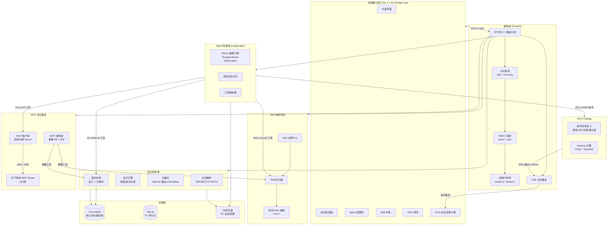
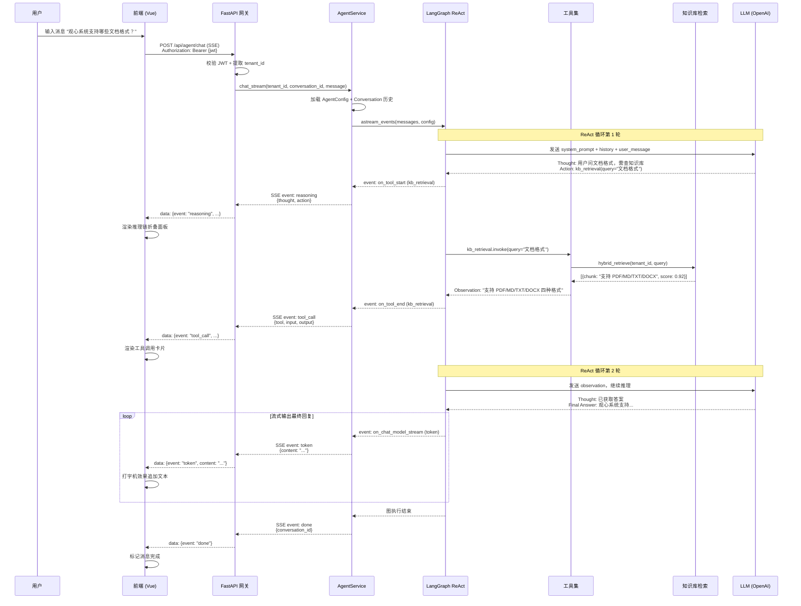
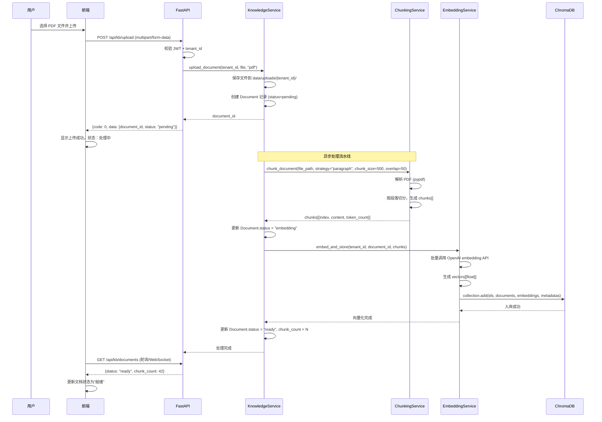
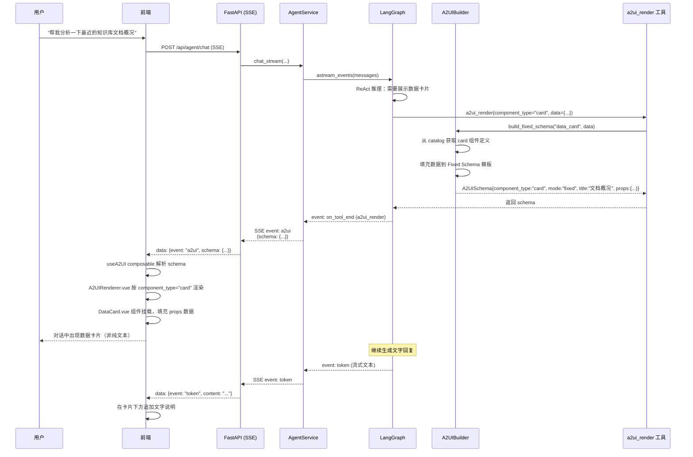
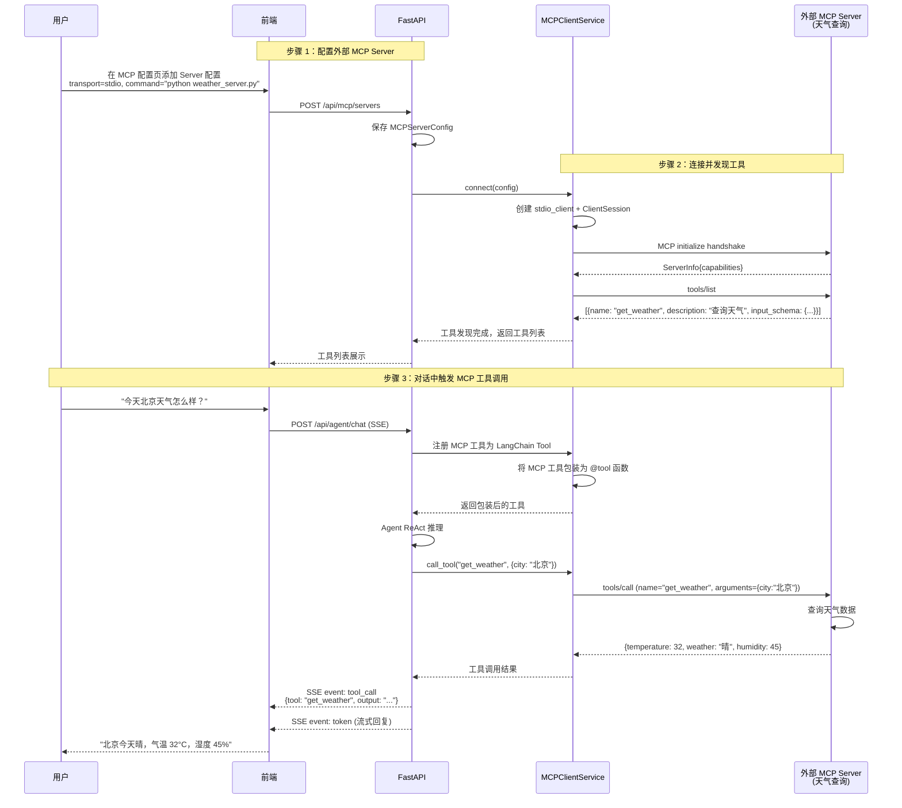
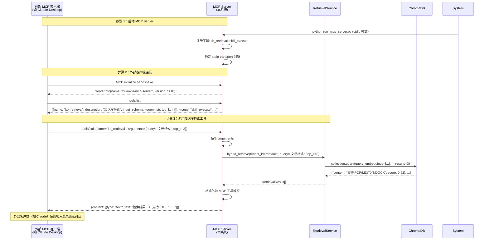
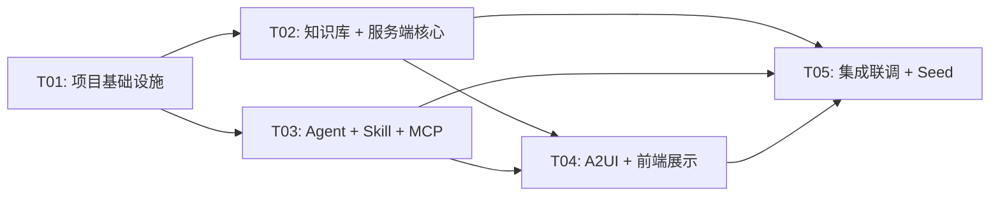

# 观心 v2 系统架构设计 + 任务分解

> 版本：v1.0
> 日期：2026-07-10
> 状态：Draft
> 作者：架构师 高见远

---

## 目录

1. [实现方案与框架选型](#1-实现方案与框架选型)
2. [文件列表及相对路径](#2-文件列表及相对路径)
3. [数据结构与接口定义](#3-数据结构与接口定义)
4. [程序调用流程（时序图）](#4-程序调用流程时序图)
5. [任务列表](#5-任务列表)
6. [依赖包列表](#6-依赖包列表)
7. [共享知识（跨文件约定）](#7-共享知识跨文件约定)
8. [待明确事项](#8-待明确事项)

---

## 1. 实现方案与框架选型

### 1.1 整体架构图



### 1.2 各模块技术选型与理由

| 模块 | 技术选型 | 选型理由 |
|------|---------|---------|
| 后端框架 | FastAPI | 异步原生支持、自动 OpenAPI 文档、SSE 流式天然适配、Python AI 生态最成熟 |
| 前端框架 | Vue 3 + Vite + TypeScript | 组合式 API 类型安全、Vite 极速 HMR、Ant Design Vue 企业级组件 |
| 状态管理 | Pinia | Vue 3 官方推荐、TypeScript 友好、轻量直觉式 API |
| Agent 框架 | LangGraph | 原生 ReAct 模式支持、状态机图编排、流式输出内置、Checkpointer 记忆持久化 |
| 向量存储 | ChromaDB（嵌入式） | 零部署成本（无需 Docker）、Python 原生 API、Demo 级性能充足 |
| 文档解析 | pypdf + markdown + python-docx | 覆盖 PDF/MD/TXT/DOCX 四种格式、纯 Python 无系统依赖 |
| MCP SDK | mcp 官方 Python SDK | 官方维护、stdio + SSE 双传输支持、协议兼容性有保障 |
| Embedding | OpenAI 兼容接口 | 可接 OpenAI/DeepSeek/Qwen、text-embedding-3-small 性价比高、配置可切换 |
| 认证 | python-jose (JWT) + 自研 API Key 中间件 | JWT 供前端、API Key 供外部系统、双模式灵活 |

### 1.3 关键设计决策

#### 决策 1：为什么选 LangGraph 而非裸 LangChain

| 维度 | 裸 LangChain | LangGraph |
|------|-------------|-----------|
| ReAct 实现 | 需手动拼 Thought-Action-Observation 循环 | 内置 `create_react_agent`，声明式定义 |
| 流式输出 | 需自行包装 generator | 原生 `astream_events` 支持 token 级流式 |
| 状态管理 | 无状态，靠 Memory 模块拼接 | StateGraph 显式状态机，状态可检查/恢复 |
| 工具调用 | 需手动处理工具选择和执行 | Agent Executor 自动路由工具调用 |
| 推理链 | 需手动提取中间步骤 | 事件流原生包含 thought/action/observation |

**结论**：LangGraph 的状态机模型天然适配 ReAct 推理链展示需求，且流式输出和工具调用开箱即用，减少约 40% 的胶水代码。

#### 决策 2：为什么 ChromaDB 嵌入式模式

- **零部署成本**：`pip install chromadb` 即用，不需要 Docker/独立进程，符合 Demo "一键启动" 要求
- **Python 原生**：直接 `import chromadb`，与 FastAPI 同进程，无网络开销
- **多租户隔离**：通过 collection 命名（`tenant-{id}-kb-{name}`）实现租户隔离，简单有效
- **性能足够**：Demo 数据量（百级文档）下嵌入式模式检索延迟 < 50ms

#### 决策 3：为什么 A2UI 用 Schema 分离模式

A2UI Catalog 借鉴 awesome-llm-apps 的 A2UI 理念，采用**组件定义与渲染器分离**模式：

```
Catalog（组件定义）  ←→  Schema（Agent 返回的数据）  ←→  Renderer（前端渲染器）
    |                        |                           |
    |--- 组件类型             |--- 组件类型 + 数据         |--- Vue 组件映射
    |--- JSON Schema 校验     |--- Fixed / Dynamic 模式   |--- 动态挂载
```

- **Fixed Schema 模式**：预定义组件树结构，Agent 只填充数据字段（P0）
- **Dynamic Schema 模式**：Agent 根据上下文动态组装组件树（P1）
- **分离的好处**：新增组件只需在 Catalog 注册定义 + 前端实现渲染器，Agent 端无需改代码

#### 决策 4：为什么 Skill 用 Python 插件而非配置化

- **Demo 需要展示 Skill 内部可调用 LLM、工具、其他 Skill**——配置化无法表达这种逻辑
- **Python 插件天然支持热加载**：通过 `importlib` 动态导入，新增 `.py` 文件即注册
- **线性 DAG 编排简单**：Skill 声明 `depends_on` 前序 Skill，执行器按拓扑排序执行

#### 决策 5：对话历史 P0 内存存储

- P0 阶段会话和配置存储在内存（Python dict），重启即失
- P1 阶段加 SQLite 持久化，数据结构预先定义，迁移成本低
- 内存存储的接口与 SQLite 存储接口统一（`ConversationStore` 抽象），切换无感

---

## 2. 文件列表及相对路径

### 2.1 项目目录结构总览

```
guanxin-v2/                          # 仓库根目录
├── docs/
│   ├── prd.md                       # 产品需求文档（已存在）
│   └── architecture.md              # 本文件（架构设计）
├── backend/                         # 后端（Python / FastAPI）
│   ├── pyproject.toml               # Python 依赖声明
│   ├── .env.example                 # 环境变量模板
│   ├── app/
│   │   ├── __init__.py
│   │   ├── main.py                  # FastAPI 应用入口
│   │   ├── config.py                # 配置管理（读取 .env）
│   │   ├── core/                    # 核心基础设施
│   │   │   ├── __init__.py
│   │   │   ├── security.py          # JWT 生成/校验 + API Key 认证
│   │   │   ├── tenant.py            # 多租户上下文管理
│   │   │   ├── responses.py         # 统一 API 响应格式
│   │   │   └── exceptions.py        # 自定义异常 + 全局异常处理
│   │   ├── models/                  # 数据模型（Pydantic）
│   │   │   ├── __init__.py
│   │   │   ├── common.py            # 通用模型（ApiResponse, PageResult）
│   │   │   ├── document.py          # 文档 + 切片模型
│   │   │   ├── agent.py             # Agent 配置模型
│   │   │   ├── skill.py             # Skill 定义模型
│   │   │   ├── conversation.py      # 会话 + 消息模型
│   │   │   ├── mcp.py               # MCP Server 配置模型
│   │   │   └── a2ui.py              # A2UI Schema 模型
│   │   ├── api/                     # API 路由层
│   │   │   ├── __init__.py
│   │   │   ├── router.py            # 主路由聚合
│   │   │   ├── auth.py              # 认证接口（登录/验证）
│   │   │   ├── knowledge.py         # 知识库管理接口
│   │   │   ├── agent.py             # Agent 对话接口（含 SSE 流式）
│   │   │   ├── skill.py             # Skill 管理接口
│   │   │   ├── mcp.py               # MCP 配置接口
│   │   │   └── a2ui.py              # A2UI 预览接口
│   │   ├── services/                # 业务逻辑层
│   │   │   ├── __init__.py
│   │   │   ├── knowledge_service.py # 知识库管理（上传/列表/删除）
│   │   │   ├── chunking_service.py  # 文档切片（段落/固定长度）
│   │   │   ├── embedding_service.py # 向量化（OpenAI 兼容 embedding）
│   │   │   ├── retrieval_service.py # 混合检索（语义 + 关键词）
│   │   │   ├── agent_service.py     # Agent 编排（调用 LangGraph）
│   │   │   ├── conversation_store.py# 会话存储（内存/SQLite 抽象）
│   │   │   ├── skill_service.py     # Skill 管理（CRUD + 启用/禁用）
│   │   │   ├── skill_registry.py    # Skill 注册中心（插件发现 + 热加载）
│   │   │   ├── skill_executor.py    # Skill 执行 + 线性 DAG 编排
│   │   │   ├── mcp_client_service.py# MCP 客户端（连接外部 Server）
│   │   │   ├── mcp_server_service.py# MCP 服务端（暴露工具）
│   │   │   └── a2ui_service.py      # A2UI Schema 生成与处理
│   │   ├── agent/                   # Agent 模块（LangGraph）
│   │   │   ├── __init__.py
│   │   │   ├── graph.py             # LangGraph 状态图定义
│   │   │   ├── state.py             # AgentState 定义
│   │   │   ├── nodes.py             # 图节点（推理/工具调用/输出）
│   │   │   ├── tools.py             # LangChain 工具定义（KB/Skill/MCP）
│   │   │   └── prompts.py           # System Prompt 模板
│   │   ├── skills/                  # Skill 插件目录
│   │   │   ├── __init__.py
│   │   │   ├── base.py              # BaseSkill 抽象基类
│   │   │   ├── data_analysis.py     # 示例 Skill：数据分析
│   │   │   └── text_summary.py      # 示例 Skill：文本摘要
│   │   ├── mcp/                     # MCP 模块
│   │   │   ├── __init__.py
│   │   │   ├── client.py            # MCP 客户端封装
│   │   │   ├── server.py            # MCP 服务端（暴露 KB + Skill 工具）
│   │   │   └── weather_server.py    # 示例：天气查询 MCP Server
│   │   ├── a2ui/                    # A2UI Catalog
│   │   │   ├── __init__.py
│   │   │   ├── catalog.py           # 组件目录定义（4 类基础组件）
│   │   │   ├── schemas.py           # Fixed/Dynamic Schema 模板
│   │   │   └── builder.py           # Schema 构建器（Agent 调用）
│   │   └── db/                      # 数据库（P1）
│   │       ├── __init__.py
│   │       └── sqlite_store.py      # SQLite 持久化实现
│   ├── scripts/
│   │   ├── seed.py                  # Seed 数据初始化
│   │   └── run_mcp_server.py        # 独立启动 MCP Server（stdio 模式）
│   └── tests/
│       ├── __init__.py
│       ├── test_knowledge.py        # 知识库测试
│       ├── test_agent.py            # Agent 测试
│       └── test_skill.py            # Skill 测试
├── frontend/                        # 前端（Vue 3 + Vite）
│   ├── package.json                 # npm 依赖声明
│   ├── vite.config.ts               # Vite 配置
│   ├── tsconfig.json                # TypeScript 配置
│   ├── index.html                   # HTML 入口
│   ├── .env.example                 # 前端环境变量
│   └── src/
│       ├── main.ts                  # 应用入口
│       ├── App.vue                  # 根组件
│       ├── router/
│       │   └── index.ts             # 路由配置
│       ├── stores/                  # Pinia 状态管理
│       │   ├── auth.ts              # 认证状态（登录/JWT/角色）
│       │   ├── chat.ts              # 对话状态（消息/流式/推理链）
│       │   ├── knowledge.ts         # 知识库状态
│       │   ├── agent.ts             # Agent 配置状态
│       │   ├── skill.ts             # Skill 状态
│       │   └── mcp.ts               # MCP 配置状态
│       ├── api/                     # API 客户端
│       │   ├── client.ts            # Axios 实例（拦截器/统一错误）
│       │   ├── auth.ts              # 认证 API
│       │   ├── knowledge.ts         # 知识库 API
│       │   ├── agent.ts             # Agent API
│       │   ├── skill.ts             # Skill API
│       │   ├── mcp.ts               # MCP API
│       │   └── sse.ts               # SSE 流式客户端
│       ├── views/                   # 页面视图
│       │   ├── Login.vue            # 登录页
│       │   ├── Chat.vue             # 对话界面（主入口）
│       │   ├── Knowledge.vue        # 知识库管理面板
│       │   ├── AgentConfig.vue      # Agent 配置页
│       │   ├── SkillMarket.vue      # Skill 市场页
│       │   ├── MCPConfig.vue        # MCP 配置页（P1）
│       │   └── A2UIPreview.vue      # A2UI 预览页（P1）
│       ├── components/              # 组件
│       │   ├── layout/
│       │   │   ├── AppLayout.vue    # 主布局（侧边导航 + 内容区）
│       │   │   └── SideNav.vue      # 侧边导航栏
│       │   ├── chat/
│       │   │   ├── MessageList.vue  # 消息列表（流式渲染）
│       │   │   ├── MessageInput.vue # 输入框
│       │   │   ├── ReasoningChain.vue # 推理链折叠面板
│       │   │   └── ToolCallCard.vue # 工具调用展示卡
│       │   ├── knowledge/
│       │   │   ├── DocUpload.vue    # 文档上传
│       │   │   ├── ChunkPreview.vue # 切片预览
│       │   │   └── RetrievalTest.vue # 检索测试
│       │   └── a2ui/                # A2UI 渲染组件
│       │       ├── A2UIRenderer.vue # 动态渲染引擎（核心）
│       │       ├── FormCard.vue     # 表单组件
│       │       ├── DataCard.vue     # 数据卡片组件
│       │       ├── ListCard.vue     # 列表组件
│       │       └── ConfirmDialog.vue # 确认框组件
│       ├── composables/             # 组合式函数
│       │   ├── useSSE.ts            # SSE 流式处理
│       │   ├── useA2UI.ts           # A2UI 渲染逻辑
│       │   └── useTenant.ts         # 租户上下文
│       ├── types/                   # TypeScript 类型
│       │   ├── api.ts               # API 响应类型
│       │   ├── chat.ts              # 对话相关类型
│       │   ├── a2ui.ts              # A2UI Schema 类型
│       │   └── models.ts            # 数据模型类型
│       └── assets/
│           └── styles/
│               └── main.css         # 全局样式
├── scripts/
│   └── start.sh                     # 一键启动脚本（后端 + 前端）
├── .gitignore
└── README.md                        # 项目说明
```

### 2.2 文件职责说明（关键文件）

| 文件路径 | 职责 | 状态 |
|---------|------|------|
| `backend/app/main.py` | FastAPI 应用创建、中间件注册、路由挂载、CORS 配置、 lifespan 事件（启动时初始化 ChromaDB/Seed 数据） | 新增 |
| `backend/app/config.py` | 使用 pydantic-settings 读取 `.env`，暴露全局 Settings 单例 | 新增 |
| `backend/app/core/security.py` | JWT 生成/校验、API Key 校验、FastAPI Depends 依赖注入 | 新增 |
| `backend/app/core/tenant.py` | 从 JWT/API Key 提取 tenant_id，注入请求上下文，ChromaDB collection 命名隔离 | 新增 |
| `backend/app/core/responses.py` | 统一 `ApiResponse[T]` 模型、分页模型、成功/失败响应快捷函数 | 新增 |
| `backend/app/services/knowledge_service.py` | 文档上传（保存文件）、文档列表/删除、调用切片+向量化流水线 | 新增 |
| `backend/app/services/chunking_service.py` | 按段落切分（`\n\n` 分割）、按固定长度切分（chunk_size + overlap） | 新增 |
| `backend/app/services/embedding_service.py` | 调用 OpenAI 兼容 embedding API、批量向量化、ChromaDB 入库 | 新增 |
| `backend/app/services/retrieval_service.py` | 语义检索（ChromaDB query）+ 关键词检索（文本匹配）、score 排序与阈值过滤 | 新增 |
| `backend/app/agent/graph.py` | 使用 LangGraph `create_react_agent` 构建 ReAct Agent，绑定工具集 | 新增 |
| `backend/app/agent/state.py` | AgentState 定义（messages, conversation_id, tenant_id, tool_history） | 新增 |
| `backend/app/agent/tools.py` | 定义 LangChain `@tool`：`kb_retrieval`、`skill_execute`、`mcp_call`、`a2ui_render` | 新增 |
| `backend/app/services/agent_service.py` | 对话入口：加载 Agent 配置、构建 LangGraph、`astream_events` 流式输出、SSE 事件转换 | 新增 |
| `backend/app/services/skill_registry.py` | 扫描 `skills/` 目录、`importlib` 动态导入、注册到内存 Map、支持热加载 | 新增 |
| `backend/app/services/skill_executor.py` | 执行单个 Skill、线性 DAG 编排（拓扑排序 + 依赖注入前序输出） | 新增 |
| `backend/app/skills/base.py` | `BaseSkill` 抽象基类：`name`, `description`, `input_schema`, `output_schema`, `execute()` | 新增 |
| `backend/app/skills/data_analysis.py` | 示例 Skill：接收数据，调用 LLM 分析，返回 A2UI 数据卡片 schema | 新增 |
| `backend/app/skills/text_summary.py` | 示例 Skill：接收长文本，调用 LLM 摘要，返回摘要文本 | 新增 |
| `backend/app/mcp/client.py` | MCP 客户端：连接外部 Server（stdio/SSE）、工具发现、工具调用 | 新增 |
| `backend/app/mcp/server.py` | MCP 服务端：注册 `kb_retrieval` + `skill_execute` 工具、stdio 传输 | 新增 |
| `backend/app/mcp/weather_server.py` | 示例外部 MCP Server：天气查询工具，独立可运行 | 新增 |
| `backend/app/a2ui/catalog.py` | 定义 4 类组件（form/card/list/confirm）的 JSON Schema 定义 | 新增 |
| `backend/app/a2ui/builder.py` | Agent 调用：根据组件类型 + 数据，构建 A2UI schema 返回 | 新增 |
| `backend/app/api/agent.py` | `POST /api/agent/chat`（SSE 流式）、`GET/PUT /api/agent/config` | 新增 |
| `backend/app/api/knowledge.py` | `POST /api/kb/upload`、`GET /api/kb/documents`、`POST /api/kb/retrieve`、`GET /api/kb/chunks/{doc_id}` | 新增 |
| `frontend/src/components/a2ui/A2UIRenderer.vue` | 接收 A2UI schema JSON，按 `component_type` 动态渲染对应 Vue 组件 | 新增 |
| `frontend/src/composables/useSSE.ts` | EventSource 封装、SSE 事件解析（text/tool_call/reasoning/a2ui）、自动重连 | 新增 |
| `frontend/src/stores/chat.ts` | 对话消息管理、流式 token 拼接、推理链状态、A2UI 卡片状态 | 新增 |

---

## 3. 数据结构与接口定义

### 3.1 核心数据模型类图

```mermaid
classDiagram
    class Tenant {
        +str id
        +str name
        +str description
    }

    class User {
        +str id
        +str username
        +str password_hash
        +str role  // admin | user
        +str tenant_id
        +str api_key
    }

    class Document {
        +str id
        +str tenant_id
        +str filename
        +str file_type  // pdf | md | txt | docx
        +str file_path
        +int file_size
        +str status  // pending | chunking | embedding | ready | failed
        +int chunk_count
        +str created_at
        +dict metadata
    }

    class Chunk {
        +str id
        +str document_id
        +str tenant_id
        +int chunk_index
        +str content
        +int token_count
        +dict metadata
    }

    class AgentConfig {
        +str id
        +str tenant_id
        +str name
        +str system_prompt
        +str model  // e.g. gpt-4o-mini
        +float temperature
        +list~str~ enabled_tools  // kb_retrieval, skill_execute, mcp_call, a2ui_render
        +list~str~ enabled_skill_ids
        +str created_at
        +str updated_at
    }

    class Conversation {
        +str id
        +str tenant_id
        +str user_id
        +str agent_config_id
        +str title
        +list~Message~ messages
        +str created_at
        +str updated_at
    }

    class Message {
        +str id
        +str conversation_id
        +str role  // user | assistant | tool
        +str content
        +list~ToolCall~ tool_calls
        +list~ReasoningStep~ reasoning_steps
        +A2UISchema a2ui_schema
        +str created_at
    }

    class ToolCall {
        +str tool_name
        +dict tool_input
        +str tool_output
        +str status  // success | error
    }

    class ReasoningStep {
        +str thought
        +str action
        +str observation
    }

    class SkillDefinition {
        +str id
        +str name
        +str description
        +dict input_schema
        +dict output_schema
        +bool enabled
        +str module_path
        +list~str~ depends_on  // DAG 前序 Skill ID
        +str version
    }

    class MCPServerConfig {
        +str id
        +str tenant_id
        +str name
        +str transport  // stdio | sse
        +str command  // stdio 模式启动命令
        +str url  // sse 模式连接地址
        +list~MCPTool~ discovered_tools
        +bool enabled
    }

    class MCPTool {
        +str name
        +str description
        +dict input_schema
    }

    class A2UISchema {
        +str component_type  // form | card | list | confirm
        +str mode  // fixed | dynamic
        +str title
        +dict props
        +list~A2UIComponent~ children
    }

    class A2UIComponent {
        +str type
        +str key
        +dict props
    }

    Document --> Tenant : belongs to
    Chunk --> Document : belongs to
    User --> Tenant : belongs to
    AgentConfig --> Tenant : belongs to
    Conversation --> Tenant : belongs to
    Conversation --> AgentConfig : uses
    Conversation --> Message : contains
    Message --> ToolCall : has
    Message --> ReasoningStep : has
    Message --> A2UISchema : may contain
    SkillDefinition --> Tenant : isolated by
    MCPServerConfig --> Tenant : belongs to
    MCPServerConfig --> MCPTool : discovers
```



### 3.2 后端核心接口定义

```python
# ===== app/core/responses.py =====
from pydantic import BaseModel
from typing import TypeVar, Generic, Optional, Any

T = TypeVar("T")

class ApiResponse(BaseModel, Generic[T]):
    """统一 API 响应格式"""
    code: int = 0           # 0=成功, 非0=业务错误码
    message: str = "success"
    data: Optional[T] = None

class PageResult(BaseModel, Generic[T]):
    """分页查询结果"""
    list: list[T]
    total: int
    page: int
    page_size: int


# ===== app/services/knowledge_service.py =====
class KnowledgeService:
    async def upload_document(
        self, tenant_id: str, file: UploadFile, file_type: str
    ) -> Document:
        """上传文档 -> 保存 -> 切片 -> 向量化 -> 入库"""

    async def list_documents(self, tenant_id: str) -> list[Document]:
        """列出租户下所有文档"""

    async def delete_document(self, tenant_id: str, doc_id: str) -> None:
        """删除文档及其切片和向量"""

    async def get_chunks(self, tenant_id: str, doc_id: str) -> list[Chunk]:
        """获取文档的切片列表"""


# ===== app/services/retrieval_service.py =====
class RetrievalService:
    async def hybrid_retrieve(
        self,
        tenant_id: str,
        query: str,
        top_k: int = 5,
        score_threshold: float = 0.0,
    ) -> list[RetrievalResult]:
        """混合检索：语义检索 + 关键词检索，返回合并排序结果"""

    async def semantic_retrieve(
        self, tenant_id: str, query: str, top_k: int
    ) -> list[RetrievalResult]:
        """ChromaDB 语义检索"""

    async def keyword_retrieve(
        self, tenant_id: str, query: str, top_k: int
    ) -> list[RetrievalResult]:
        """关键词文本匹配检索"""


# ===== app/services/agent_service.py =====
class AgentService:
    async def chat_stream(
        self,
        tenant_id: str,
        user_id: str,
        conversation_id: str,
        message: str,
        agent_config: AgentConfig,
    ) -> AsyncGenerator[str, None]:
        """
        Agent 对话流式输出。
        yield SSE 格式事件：
        - event: token    data: {"content": "..."}
        - event: reasoning data: {"thought": "...", "action": "...", "observation": "..."}
        - event: tool_call data: {"tool": "kb_retrieval", "input": {...}, "output": "..."}
        - event: a2ui     data: {"schema": {...}}
        - event: done     data: {"conversation_id": "..."}
        - event: error    data: {"message": "..."}
        """

    async def get_agent_config(self, tenant_id: str) -> AgentConfig:
        """获取 Agent 配置"""

    async def update_agent_config(
        self, tenant_id: str, config: AgentConfigUpdate
    ) -> AgentConfig:
        """更新 Agent 配置"""


# ===== app/services/skill_registry.py =====
class SkillRegistry:
    def register_all(self) -> None:
        """扫描 skills/ 目录，importlib 动态导入所有 Skill 插件"""

    def register(self, skill: BaseSkill) -> None:
        """注册单个 Skill"""

    def unregister(self, skill_name: str) -> None:
        """取消注册"""

    def get_skill(self, name: str) -> Optional[BaseSkill]:
        """按名称获取 Skill"""

    def list_skills(self) -> list[SkillDefinition]:
        """列出所有已注册 Skill"""

    def reload(self) -> list[str]:
        """热加载：重新扫描目录，返回新增 Skill 名称列表"""

    def set_enabled(self, name: str, enabled: bool) -> None:
        """启用/禁用 Skill"""


# ===== app/skills/base.py =====
from abc import ABC, abstractmethod

class BaseSkill(ABC):
    """Skill 插件基类，所有 Skill 继承此类"""
    name: str
    description: str
    input_schema: dict        # JSON Schema
    output_schema: dict       # JSON Schema
    depends_on: list[str] = []  # DAG 前序依赖

    @abstractmethod
    async def execute(self, input_data: dict, context: SkillContext) -> dict:
        """执行 Skill，返回输出数据"""
        pass


class SkillContext:
    """Skill 执行上下文，注入 LLM 和工具调用能力"""
    llm: ChatOpenAI              # LLM 客户端
    tenant_id: str
    call_tool: Callable          # 调用其他工具的函数
    call_skill: Callable         # 调用其他 Skill 的函数


# ===== app/mcp/client.py =====
class MCPClientService:
    async def connect(self, config: MCPServerConfig) -> None:
        """连接外部 MCP Server（stdio 或 SSE 传输）"""

    async def list_tools(self) -> list[MCPTool]:
        """发现外部 Server 暴露的工具列表"""

    async def call_tool(self, tool_name: str, arguments: dict) -> Any:
        """调用外部 MCP 工具"""

    async def disconnect(self) -> None:
        """断开连接"""


# ===== app/mcp/server.py =====
class MCPServerService:
    def register_tools(self) -> None:
        """注册本系统暴露的 MCP 工具：kb_retrieval + skill_execute"""

    async def run_stdio(self) -> None:
        """以 stdio 模式启动 MCP Server"""

    async def run_sse(self, port: int) -> None:
        """以 SSE 模式启动 MCP Server（P1）"""


# ===== app/a2ui/catalog.py =====
class A2UICatalog:
    """A2UI 组件目录，定义可用组件类型和校验 Schema"""

    COMPONENT_TYPES = {
        "form": FormComponentDef,
        "card": CardComponentDef,
        "list": ListComponentDef,
        "confirm": ConfirmComponentDef,
    }

    def validate_schema(self, schema: A2UISchema) -> bool:
        """校验 Agent 返回的 A2UI schema 是否合法"""

    def get_component_def(self, component_type: str) -> ComponentDef:
        """获取组件定义"""


# ===== app/a2ui/builder.py =====
class A2UIBuilder:
    def build_fixed_schema(
        self, template_name: str, data: dict
    ) -> A2UISchema:
        """Fixed Schema 模式：用预定义模板填充数据"""

    def build_dynamic_schema(
        self, components: list[dict]
    ) -> A2UISchema:
        """Dynamic Schema 模式：动态组装组件树（P1）"""
```

### 3.3 前端核心类型定义

```typescript
// ===== src/types/api.ts =====
interface ApiResponse<T = unknown> {
  code: number;        // 0=成功, 非0=错误
  message: string;
  data: T;
}

interface PageResult<T> {
  list: T[];
  total: number;
  page: number;
  page_size: number;
}

// ===== src/types/chat.ts =====
interface ChatMessage {
  id: string;
  role: 'user' | 'assistant' | 'tool';
  content: string;
  tool_calls?: ToolCall[];
  reasoning_steps?: ReasoningStep[];
  a2ui_schema?: A2UISchema;
  created_at: string;
}

interface ToolCall {
  tool_name: string;
  tool_input: Record<string, unknown>;
  tool_output: string;
  status: 'success' | 'error';
}

interface ReasoningStep {
  thought: string;
  action: string;
  observation: string;
}

// SSE 事件类型
type SSEEvent =
  | { event: 'token'; data: { content: string } }
  | { event: 'reasoning'; data: { thought: string; action: string; observation: string } }
  | { event: 'tool_call'; data: { tool: string; input: Record<string, unknown>; output: string } }
  | { event: 'a2ui'; data: { schema: A2UISchema } }
  | { event: 'done'; data: { conversation_id: string } }
  | { event: 'error'; data: { message: string } };

// ===== src/types/a2ui.ts =====
interface A2UISchema {
  component_type: 'form' | 'card' | 'list' | 'confirm';
  mode: 'fixed' | 'dynamic';
  title: string;
  props: Record<string, unknown>;
  children?: A2UIComponent[];
}

interface A2UIComponent {
  type: string;        // input | textarea | select | table | chart | button | text
  key: string;
  props: Record<string, unknown>;
}

// ===== src/types/models.ts =====
interface Document {
  id: string;
  tenant_id: string;
  filename: string;
  file_type: 'pdf' | 'md' | 'txt' | 'docx';
  file_size: number;
  status: 'pending' | 'chunking' | 'embedding' | 'ready' | 'failed';
  chunk_count: number;
  created_at: string;
  metadata: Record<string, unknown>;
}

interface AgentConfig {
  id: string;
  name: string;
  system_prompt: string;
  model: string;
  temperature: number;
  enabled_tools: string[];
  enabled_skill_ids: string[];
}

interface SkillDefinition {
  id: string;
  name: string;
  description: string;
  input_schema: Record<string, unknown>;
  output_schema: Record<string, unknown>;
  enabled: boolean;
  depends_on: string[];
  version: string;
}
```

### 3.4 数据库表结构（P1 SQLite）

```sql
-- P1 阶段使用 SQLite 持久化，P0 阶段用内存 dict 存储，数据结构一致

CREATE TABLE tenants (
    id TEXT PRIMARY KEY,
    name TEXT NOT NULL,
    description TEXT
);

CREATE TABLE users (
    id TEXT PRIMARY KEY,
    username TEXT NOT NULL UNIQUE,
    password_hash TEXT NOT NULL,
    role TEXT NOT NULL CHECK (role IN ('admin', 'user')),
    tenant_id TEXT NOT NULL REFERENCES tenants(id),
    api_key TEXT UNIQUE
);

CREATE TABLE documents (
    id TEXT PRIMARY KEY,
    tenant_id TEXT NOT NULL,
    filename TEXT NOT NULL,
    file_type TEXT NOT NULL,
    file_path TEXT NOT NULL,
    file_size INTEGER NOT NULL,
    status TEXT NOT NULL DEFAULT 'pending',
    chunk_count INTEGER DEFAULT 0,
    metadata TEXT,  -- JSON
    created_at TEXT NOT NULL DEFAULT (datetime('now'))
);

CREATE TABLE chunks (
    id TEXT PRIMARY KEY,
    document_id TEXT NOT NULL REFERENCES documents(id) ON DELETE CASCADE,
    tenant_id TEXT NOT NULL,
    chunk_index INTEGER NOT NULL,
    content TEXT NOT NULL,
    token_count INTEGER,
    metadata TEXT  -- JSON
);

CREATE TABLE agent_configs (
    id TEXT PRIMARY KEY,
    tenant_id TEXT NOT NULL,
    name TEXT NOT NULL,
    system_prompt TEXT,
    model TEXT DEFAULT 'gpt-4o-mini',
    temperature REAL DEFAULT 0.7,
    enabled_tools TEXT,  -- JSON array
    enabled_skill_ids TEXT,  -- JSON array
    created_at TEXT NOT NULL DEFAULT (datetime('now')),
    updated_at TEXT NOT NULL DEFAULT (datetime('now'))
);

CREATE TABLE conversations (
    id TEXT PRIMARY KEY,
    tenant_id TEXT NOT NULL,
    user_id TEXT NOT NULL,
    agent_config_id TEXT NOT NULL,
    title TEXT,
    created_at TEXT NOT NULL DEFAULT (datetime('now')),
    updated_at TEXT NOT NULL DEFAULT (datetime('now'))
);

CREATE TABLE messages (
    id TEXT PRIMARY KEY,
    conversation_id TEXT NOT NULL REFERENCES conversations(id) ON DELETE CASCADE,
    role TEXT NOT NULL,
    content TEXT,
    tool_calls TEXT,  -- JSON
    reasoning_steps TEXT,  -- JSON
    a2ui_schema TEXT,  -- JSON
    created_at TEXT NOT NULL DEFAULT (datetime('now'))
);

CREATE TABLE mcp_server_configs (
    id TEXT PRIMARY KEY,
    tenant_id TEXT NOT NULL,
    name TEXT NOT NULL,
    transport TEXT NOT NULL CHECK (transport IN ('stdio', 'sse')),
    command TEXT,
    url TEXT,
    discovered_tools TEXT,  -- JSON
    enabled INTEGER DEFAULT 1
);
```

---

## 4. 程序调用流程（时序图）

### 4.1 用户对话 → Agent 推理 → 工具调用 → 流式回复



### 4.2 文档上传 → 切片 → 向量化 → 入库



### 4.3 Agent 返回 A2UI Schema → 前端渲染



### 4.4 MCP 客户端连接外部 Server → 工具发现 → 调用



### 4.5 外部客户端连接本系统 MCP Server → 调用知识库检索



---

## 5. 任务列表

### 5.1 任务依赖图



### 5.2 P0 任务详情

#### T01: 项目基础设施

| 项 | 内容 |
|----|------|
| **任务 ID** | T01 |
| **任务名** | 项目基础设施（monorepo 结构 + 后端骨架 + 前端骨架 + 配置 + 启动脚本） |
| **优先级** | P0 |
| **依赖** | 无 |
| **复杂度** | M |

**涉及文件（新增）：**

后端：
- `backend/pyproject.toml` — Python 依赖声明
- `backend/.env.example` — 环境变量模板（LLM API Key、ChromaDB 路径、JWT Secret 等）
- `backend/app/__init__.py`
- `backend/app/main.py` — FastAPI 应用入口（CORS、路由挂载、lifespan 初始化）
- `backend/app/config.py` — pydantic-settings 配置管理
- `backend/app/core/__init__.py`
- `backend/app/core/responses.py` — 统一 ApiResponse 模型
- `backend/app/core/exceptions.py` — 自定义异常 + 全局异常处理器
- `backend/app/core/tenant.py` — 多租户上下文（tenant_id 提取与注入）
- `backend/app/core/security.py` — JWT 生成/校验 + API Key 认证依赖
- `backend/app/models/__init__.py`
- `backend/app/models/common.py` — 通用模型（ApiResponse, PageResult, Tenant, User）
- `backend/app/api/__init__.py`
- `backend/app/api/router.py` — 主路由聚合

前端：
- `frontend/package.json` — npm 依赖声明
- `frontend/vite.config.ts` — Vite 配置（代理 /api 到后端）
- `frontend/tsconfig.json` — TypeScript 配置
- `frontend/index.html`
- `frontend/.env.example`
- `frontend/src/main.ts` — Vue 应用入口
- `frontend/src/App.vue` — 根组件
- `frontend/src/router/index.ts` — Vue Router 路由配置
- `frontend/src/types/api.ts` — API 响应类型
- `frontend/src/types/models.ts` — 数据模型类型
- `frontend/src/api/client.ts` — Axios 实例（拦截器、统一错误处理）
- `frontend/src/stores/auth.ts` — 认证状态（登录/JWT/角色/租户）
- `frontend/src/components/layout/AppLayout.vue` — 主布局
- `frontend/src/components/layout/SideNav.vue` — 侧边导航
- `frontend/src/assets/styles/main.css` — 全局样式

脚本与配置：
- `scripts/start.sh` — 一键启动脚本
- `.gitignore`

**验收标准：**
- 后端 `uvicorn app.main:app` 可启动，访问 `/docs` 看到 Swagger 文档
- 前端 `npm run dev` 可启动，显示带侧边导航的空布局页面
- `scripts/start.sh` 可同时启动前后端
- `.env.example` 包含所有必要配置项

---

#### T02: 知识库管理 + 服务端核心

| 项 | 内容 |
|----|------|
| **任务 ID** | T02 |
| **任务名** | 知识库管理（文档上传/切片/向量化/混合检索）+ 服务端核心（认证鉴权 + 多租户 + API 网关 + RESTful 接口） |
| **优先级** | P0 |
| **依赖** | T01 |
| **复杂度** | L |

**涉及文件（新增）：**

后端：
- `backend/app/models/document.py` — Document + Chunk Pydantic 模型
- `backend/app/api/auth.py` — 登录接口（POST /api/auth/login）、预置用户
- `backend/app/api/knowledge.py` — 知识库接口（upload/documents/retrieve/chunks）
- `backend/app/services/knowledge_service.py` — 文档管理（上传/列表/删除）
- `backend/app/services/chunking_service.py` — 切片引擎（段落/固定长度）
- `backend/app/services/embedding_service.py` — 向量化 + ChromaDB 入库
- `backend/app/services/retrieval_service.py` — 混合检索（语义+关键词）
- `backend/app/services/conversation_store.py` — 会话存储抽象（P0 内存实现）

前端：
- `frontend/src/api/auth.ts` — 认证 API
- `frontend/src/api/knowledge.ts` — 知识库 API
- `frontend/src/stores/knowledge.ts` — 知识库状态
- `frontend/src/views/Login.vue` — 登录页
- `frontend/src/views/Knowledge.vue` — 知识库管理面板
- `frontend/src/components/knowledge/DocUpload.vue` — 文档上传组件
- `frontend/src/components/knowledge/ChunkPreview.vue` — 切片预览组件
- `frontend/src/components/knowledge/RetrievalTest.vue` — 检索测试组件
- `frontend/src/composables/useTenant.ts` — 租户上下文

**覆盖需求：** KB-001, KB-002, KB-003, KB-004, SRV-001, SRV-003, SRV-004, SRV-005, SRV-006, SRV-007, FE-002, FE-008, INF-002

**验收标准：**
- 上传 PDF/MD/TXT/DOCX 文档后自动切片、向量化，状态变为 ready
- 切片预览可查看 chunk 列表和内容
- 检索测试返回 score 排序结果，支持 top-k 和阈值过滤
- 登录页可登录，JWT 携带在后续请求中
- 不同租户的文档和检索结果互不可见

---

#### T03: Agent 智能体 + Skill 技能系统 + MCP 协议集成

| 项 | 内容 |
|----|------|
| **任务 ID** | T03 |
| **任务名** | Agent ReAct 推理（多轮对话/流式输出/工具调用/推理链展示）+ Skill 注册/发现/执行/线性 DAG 编排 + MCP 客户端/服务端 |
| **优先级** | P0 |
| **依赖** | T01 |
| **复杂度** | L |

**涉及文件（新增）：**

后端 Agent：
- `backend/app/agent/__init__.py`
- `backend/app/agent/graph.py` — LangGraph ReAct Agent 图定义
- `backend/app/agent/state.py` — AgentState 定义
- `backend/app/agent/nodes.py` — 图节点实现
- `backend/app/agent/tools.py` — LangChain @tool 定义（kb_retrieval, skill_execute, mcp_call, a2ui_render）
- `backend/app/agent/prompts.py` — System Prompt 模板
- `backend/app/services/agent_service.py` — Agent 编排 + SSE 流式输出

后端 Skill：
- `backend/app/models/skill.py` — SkillDefinition 模型
- `backend/app/models/agent.py` — AgentConfig 模型
- `backend/app/models/conversation.py` — Conversation + Message 模型
- `backend/app/api/skill.py` — Skill 管理接口
- `backend/app/api/agent.py` — Agent 对话接口（SSE 流式）+ Agent 配置接口
- `backend/app/services/skill_service.py` — Skill CRUD + 启用/禁用
- `backend/app/services/skill_registry.py` — Skill 注册中心（importlib 动态导入 + 热加载）
- `backend/app/services/skill_executor.py` — Skill 执行 + 线性 DAG 编排
- `backend/app/skills/__init__.py`
- `backend/app/skills/base.py` — BaseSkill 抽象基类 + SkillContext
- `backend/app/skills/data_analysis.py` — 示例 Skill：数据分析
- `backend/app/skills/text_summary.py` — 示例 Skill：文本摘要

后端 MCP：
- `backend/app/models/mcp.py` — MCPServerConfig + MCPTool 模型
- `backend/app/api/mcp.py` — MCP 配置接口
- `backend/app/mcp/__init__.py`
- `backend/app/mcp/client.py` — MCP 客户端（stdio + SSE 连接、工具发现、工具调用）
- `backend/app/mcp/server.py` — MCP 服务端（暴露 kb_retrieval + skill_execute）
- `backend/app/mcp/weather_server.py` — 示例天气查询 MCP Server
- `backend/app/services/mcp_client_service.py` — MCP 客户端服务层
- `backend/app/services/mcp_server_service.py` — MCP 服务端服务层
- `backend/scripts/run_mcp_server.py` — 独立启动 MCP Server 脚本

前端：
- `frontend/src/api/agent.ts` — Agent API（含 SSE 流式请求）
- `frontend/src/api/skill.ts` — Skill API
- `frontend/src/api/mcp.ts` — MCP API
- `frontend/src/api/sse.ts` — SSE 流式客户端封装
- `frontend/src/stores/chat.ts` — 对话状态（消息/流式/推理链）
- `frontend/src/stores/agent.ts` — Agent 配置状态
- `frontend/src/stores/skill.ts` — Skill 状态
- `frontend/src/views/AgentConfig.vue` — Agent 配置页
- `frontend/src/views/SkillMarket.vue` — Skill 市场页
- `frontend/src/views/MCPConfig.vue` — MCP 配置页（P1 前端，P0 后端接口先通）
- `frontend/src/composables/useSSE.ts` — SSE 流式处理
- `frontend/src/types/chat.ts` — 对话类型定义

**覆盖需求：** AG-001, AG-002, AG-003, AG-004, AG-005, SK-001, SK-002, SK-003, SK-004, MCP-001, MCP-002, MCP-003, SRV-002, FE-003, FE-004

**验收标准：**
- 多轮对话可引用上下文，流式输出打字机效果，首 token < 1s
- 推理链可折叠展示 Thought → Action → Observation
- Agent 可调用 kb_retrieval、skill_execute、mcp_call 三类工具
- Skill 市场展示已注册 Skill，可启用/禁用，禁用后 Agent 不可调用
- 至少 2 个示例 Skill 可执行
- MCP 客户端可连接天气查询 Server 并发现工具
- 对话中可触发 MCP 工具调用
- 外部客户端可连接本系统 MCP Server，调用知识库检索工具
- MCP Server 支持 stdio 传输

---

#### T04: A2UI Catalog + 前端展示层

| 项 | 内容 |
|----|------|
| **任务 ID** | T04 |
| **任务名** | A2UI 组件目录定义 + 动态渲染引擎 + Fixed Schema 模式 + 前端对话界面 + A2UI 预览 |
| **优先级** | P0 |
| **依赖** | T02, T03 |
| **复杂度** | L |

**涉及文件（新增）：**

后端 A2UI：
- `backend/app/models/a2ui.py` — A2UISchema + A2UIComponent 模型
- `backend/app/a2ui/__init__.py`
- `backend/app/a2ui/catalog.py` — 组件目录定义（form/card/list/confirm 四类）
- `backend/app/a2ui/schemas.py` — Fixed Schema 模板
- `backend/app/a2ui/builder.py` — Schema 构建器（Agent 调用）
- `backend/app/api/a2ui.py` — A2UI 预览接口
- `backend/app/services/a2ui_service.py` — A2UI 处理服务

前端 A2UI + 对话界面：
- `frontend/src/types/a2ui.ts` — A2UI Schema 类型
- `frontend/src/components/a2ui/A2UIRenderer.vue` — 动态渲染引擎核心
- `frontend/src/components/a2ui/FormCard.vue` — 表单组件
- `frontend/src/components/a2ui/DataCard.vue` — 数据卡片组件
- `frontend/src/components/a2ui/ListCard.vue` — 列表组件
- `frontend/src/components/a2ui/ConfirmDialog.vue` — 确认框组件
- `frontend/src/composables/useA2UI.ts` — A2UI 渲染逻辑
- `frontend/src/views/Chat.vue` — 对话界面（主入口）
- `frontend/src/views/A2UIPreview.vue` — A2UI 预览页（P1 前端）
- `frontend/src/components/chat/MessageList.vue` — 消息列表（流式渲染）
- `frontend/src/components/chat/MessageInput.vue` — 输入框
- `frontend/src/components/chat/ReasoningChain.vue` — 推理链折叠面板
- `frontend/src/components/chat/ToolCallCard.vue` — 工具调用展示卡
- `frontend/src/stores/mcp.ts` — MCP 状态

**覆盖需求：** A2UI-001, A2UI-002, A2UI-003, A2UI-004, FE-001, FE-005

**验收标准：**
- Agent 可在回复中附带 A2UI schema，前端渲染为卡片组件
- A2UIRenderer 可渲染 form/card/list/confirm 四类组件
- Fixed Schema 模式：预定义模板，Agent 填充数据后前端正确渲染
- 对话界面支持流式消息渲染、推理链折叠、A2UI 卡片内嵌
- 对话中出现非纯文本的卡片式 UI

---

#### T05: 集成联调 + Seed 数据 + 启动脚本 + 文档

| 项 | 内容 |
|----|------|
| **任务 ID** | T05 |
| **任务名** | 全链路集成联调 + Seed 数据 + 一键启动脚本完善 + README |
| **优先级** | P0 |
| **依赖** | T02, T03, T04 |
| **复杂度** | M |

**涉及文件（新增/修改）：**

- `backend/scripts/seed.py` — Seed 数据（预置租户、用户、示例文档、示例 Agent 配置、示例 Skill）
- `scripts/start.sh` — 完善一键启动脚本（后端 + 前端 + 初始化）
- `backend/app/main.py` — 修改：lifespan 中调用 seed 初始化
- `backend/app/config.py` — 修改：增加 seed 相关配置
- `frontend/src/views/Chat.vue` — 修改：集成 A2UI 渲染到对话流
- `README.md` — 项目说明、架构图、快速启动指南
- `backend/tests/__init__.py`
- `backend/tests/test_knowledge.py` — 知识库基础测试
- `backend/tests/test_agent.py` — Agent 基础测试
- `backend/tests/test_skill.py` — Skill 基础测试

**覆盖需求：** INF-001, INF-003, INF-004, INF-005, INF-006, S-2, S-3, S-4, S-6

**验收标准：**
- 首次启动自动初始化 Seed 数据（2 个租户、admin/user 用户、示例文档、示例 Agent、示例 Skill）
- 执行 `scripts/start.sh` 后所有服务可用
- 知识库 → Agent → 前端的核心链路跑通（上传文档后可对话问答）
- Agent 可调用知识库检索、Skill、MCP 工具三类工具
- A2UI 组件可由 Agent 声明式返回并前端动态渲染
- README 包含快速启动指南

---

### 5.3 P1 任务列表（Phase 2）

| 任务 ID | 任务名 | 覆盖需求 | 依赖 |
|---------|--------|---------|------|
| T06 | 对话历史 SQLite 持久化 | AG-008, KB-005, KB-006 | T05 |
| T07 | MCP SSE 传输 + MCP 配置管理前端 | MCP-004, MCP-005, FE-006 | T03 |
| T08 | Skill 热加载 + 线性 DAG 编排 | SK-005, SK-006 | T03 |
| T09 | A2UI Dynamic Schema + 图表组件 + 预览页 | A2UI-005, A2UI-006, A2UI-007 | T04 |
| T10 | 多 Agent 配置 + 上下文窗口管理 | AG-006, AG-007 | T03 |
| T11 | 租户管理页 + 切换租户 | FE-007 | T02 |
| T12 | A2UI 组件交互回调 | A2UI-009 | T04 |

---

## 6. 依赖包列表

### 6.1 后端 Python 依赖（pyproject.toml）

```toml
[project]
name = "guanxin-v2-backend"
version = "1.0.0"
requires-python = ">=3.11"

dependencies = [
    # Web 框架
    "fastapi>=0.115.0",            # Web 框架，自动 OpenAPI 文档
    "uvicorn[standard]>=0.30.0",   # ASGI 服务器，支持 SSE 流式
    "python-multipart>=0.0.9",     # 文件上传支持

    # 配置管理
    "pydantic-settings>=2.5.0",    # .env 配置读取

    # 认证
    "python-jose[cryptography]>=3.3.0",  # JWT 生成与校验
    "passlib[bcrypt]>=1.7.4",      # 密码哈希

    # Agent / LLM
    "langchain>=0.3.0",            # LLM 框架基础
    "langgraph>=0.2.0",            # ReAct Agent 状态机
    "langchain-openai>=0.2.0",     # OpenAI 兼容 LLM + Embedding

    # 向量存储
    "chromadb>=0.5.0",             # 嵌入式向量数据库

    # 文档解析
    "pypdf>=4.0.0",                # PDF 解析
    "python-docx>=1.1.0",          # DOCX 解析
    # markdown 和 txt 无需额外库，原生处理

    # MCP 协议
    "mcp>=1.0.0",                  # MCP 官方 Python SDK（stdio + SSE）

    # SSE 流式
    "sse-starlette>=2.1.0",        # FastAPI SSE 响应支持

    # 数据库（P1）
    "aiosqlite>=0.20.0",           # SQLite 异步驱动
]

[project.optional-dependencies]
dev = [
    "pytest>=8.0.0",
    "pytest-asyncio>=0.24.0",
    "httpx>=0.27.0",               # 测试用 HTTP 客户端
]
```

### 6.2 前端 npm 依赖（package.json）

```json
{
  "name": "guanxin-v2-frontend",
  "version": "1.0.0",
  "type": "module",
  "scripts": {
    "dev": "vite",
    "build": "vue-tsc && vite build",
    "preview": "vite preview"
  },
  "dependencies": {
    "vue": "^3.5.0",                    "Vue 3 核心框架",
    "vue-router": "^4.4.0",             "路由管理",
    "pinia": "^2.2.0",                  "状态管理",
    "ant-design-vue": "^4.2.0",         "UI 组件库",
    "@ant-design/icons-vue": "^7.0.0",  "Ant Design 图标",
    "axios": "^1.7.0",                  "HTTP 客户端",
    "markdown-it": "^14.0.0",           "Markdown 渲染",
    "dayjs": "^1.11.0"                  "日期处理"
  },
  "devDependencies": {
    "@vitejs/plugin-vue": "^5.1.0",     "Vite Vue 插件",
    "vite": "^5.4.0",                   "构建工具",
    "typescript": "^5.5.0",             "TypeScript 编译器",
    "vue-tsc": "^2.1.0"                 "Vue 类型检查"
  }
}
```

---

## 7. 共享知识（跨文件约定）

### 7.1 代码规范

| 约定 | 规则 |
|------|------|
| 后端命名 | Python: snake_case 函数/变量，PascalCase 类名，模块文件全小写 |
| 前端命名 | TypeScript: camelCase 函数/变量，PascalCase 类/组件/接口，kebab-case 文件名（Vue 组件 PascalCase） |
| 目录结构 | 后端按 `api/ services/ models/ core/` 分层，前端按 `views/ components/ stores/ api/ composables/ types/` 分层 |
| Import 顺序 | 标准库 → 第三方库 → 项目内部模块，组间空行 |
| 类型注解 | 后端所有函数签名必须有类型注解，前端所有接口必须有 TypeScript 类型 |
| 文档字符串 | 后端每个 service 方法必须有 docstring，说明参数和返回值 |

### 7.2 API 响应格式统一规范

```python
# 所有 RESTful API 统一返回格式
{
    "code": 0,           # 0=成功, 非0=业务错误码
    "message": "success",
    "data": { ... }      # 业务数据，失败时为 null
}

# 错误响应
{
    "code": 1001,
    "message": "文档格式不支持",
    "data": null
}

# 业务错误码定义
# 0    SUCCESS       成功
# 1001 PARAM_INVALID  参数错误
# 1002 UNAUTHORIZED   未认证
# 1003 FORBIDDEN      无权限
# 1004 NOT_FOUND      资源不存在
# 1009 RATE_LIMITED   频率限制
# 2001 KB_ERROR       知识库错误
# 2002 AGENT_ERROR    Agent 错误
# 2003 SKILL_ERROR    Skill 错误
# 2004 MCP_ERROR      MCP 错误
# 5000 INTERNAL       内部错误
```

### 7.3 SSE 消息格式统一规范

```
# SSE 事件流格式（text/event-stream）
# 每个事件由 event 行和 data 行组成，空行分隔

event: token
data: {"content": "你好"}

event: reasoning
data: {"thought": "用户问文档格式", "action": "kb_retrieval(query=文档格式)", "observation": ""}

event: tool_call
data: {"tool": "kb_retrieval", "input": {"query": "文档格式"}, "output": "支持 PDF/MD/TXT/DOCX", "status": "success"}

event: a2ui
data: {"schema": {"component_type": "card", "mode": "fixed", "title": "文档概况", "props": {...}}}

event: done
data: {"conversation_id": "conv-xxx", "message_id": "msg-xxx"}

event: error
data: {"message": "LLM 调用超时", "code": 2002}
```

### 7.4 A2UI Schema 格式规范

```json
{
  "component_type": "card",
  "mode": "fixed",
  "title": "文档概况",
  "props": {
    "description": "当前知识库文档统计",
    "fields": [
      {"label": "文档总数", "value": 15, "type": "number"},
      {"label": "切片总数", "value": 342, "type": "number"},
      {"label": "最近上传", "value": "产品手册.pdf", "type": "text"}
    ]
  },
  "children": []
}
```

| 字段 | 类型 | 说明 |
|------|------|------|
| component_type | string | 组件类型：form / card / list / confirm |
| mode | string | 渲染模式：fixed（预定义模板）/ dynamic（动态组装，P1） |
| title | string | 卡片标题 |
| props | object | 组件属性数据，结构由 component_type 决定 |
| children | array | 子组件列表（Dynamic Schema 模式使用） |

### 7.5 配置管理约定

```bash
# .env 配置项
# ===== LLM 配置 =====
LLM_API_KEY=sk-xxx                    # OpenAI 兼容 API Key
LLM_BASE_URL=https://api.openai.com/v1  # 可切换为 DeepSeek/Qwen
LLM_MODEL=gpt-4o-mini                 # 对话模型
EMBEDDING_MODEL=text-embedding-3-small # Embedding 模型

# ===== ChromaDB 配置 =====
CHROMA_DB_PATH=./data/chromadb        # 嵌入式 ChromaDB 存储路径

# ===== 认证配置 =====
JWT_SECRET=your-secret-key            # JWT 签名密钥
JWT_ALGORITHM=HS256
JWT_EXPIRE_HOURS=24

# ===== 服务配置 =====
BACKEND_HOST=0.0.0.0
BACKEND_PORT=8000
FRONTEND_PORT=5173
CORS_ORIGINS=http://localhost:5173

# ===== 数据存储 =====
UPLOAD_DIR=./data/uploads             # 文档上传存储目录
SQLITE_PATH=./data/guanxin.db         # P1 SQLite 路径
```

### 7.6 多租户隔离约定

- **数据隔离**：所有 ChromaDB collection 命名为 `tenant-{tenant_id}-kb`，所有查询带 `tenant_id` 过滤
- **上下文传递**：`tenant_id` 从 JWT payload 提取，通过 FastAPI `Depends` 注入到每个请求
- **预置租户**：`tenant-a`（默认管理员租户）、`tenant-b`（演示隔离用）
- **API Key 认证**：API Key 中编码 `tenant_id`，格式 `{tenant_id}:{random_key}`

---

## 8. 待明确事项

| 编号 | 事项 | 影响范围 | 当前假设 |
|------|------|---------|---------|
| D-1 | LLM API Key 的获取方式：用户提供还是预置？ | 开发体验 | 假设开发者自行在 `.env` 中配置，`.env.example` 提供模板 |
| D-2 | 文档上传大小限制 | 知识库管理 | 假设单文件上限 50MB，Demo 级别足够 |
| D-3 | ChromaDB 嵌入式模式在多进程下的并发安全性 | MCP Server 独立进程 | 假设 MCP Server 进程通过 HTTP API 调用主服务检索，不直接访问 ChromaDB |
| D-4 | MCP Server 暴露工具时的认证方式 | MCP 协议集成 | 假设 P0 不做 MCP Server 认证（本地 Demo），P1 加 API Key |
| D-5 | Skill 热加载的触发机制 | Skill 技术系统 | 假设 P0 手动触发 `POST /api/skills/reload`，P1 用 watchdog 文件监听自动热加载 |
| D-6 | A2UI Fixed Schema 模板的数量和具体内容 | A2UI Catalog | 假设 P0 预置 4 个模板（对应 4 类组件），具体模板内容在实现时确定 |
| D-7 | 前端是否需要暗色主题（FE-009 为 P2） | 前端展示层 | 假设 P0 仅亮色主题，Ant Design Vue 默认主题 |
| D-8 | 对话历史 P0 内存存储的容量上限 | Agent 智能体 | 假设每会话保留最近 50 条消息，超过后截断旧消息 |

---

*本文档为 Draft 状态，待团队评审后定稿。下一步交由工程师寇豆码按任务列表进行代码实现。*
