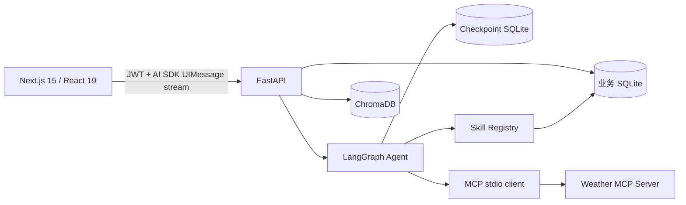
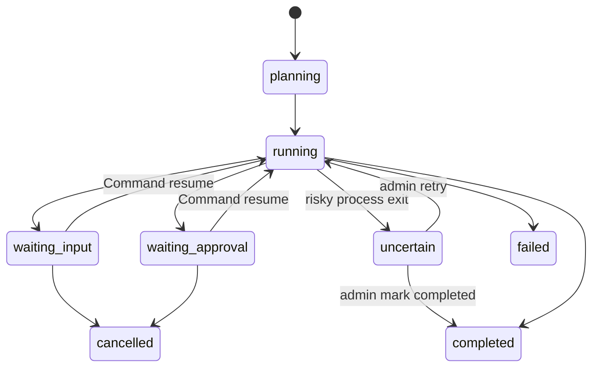
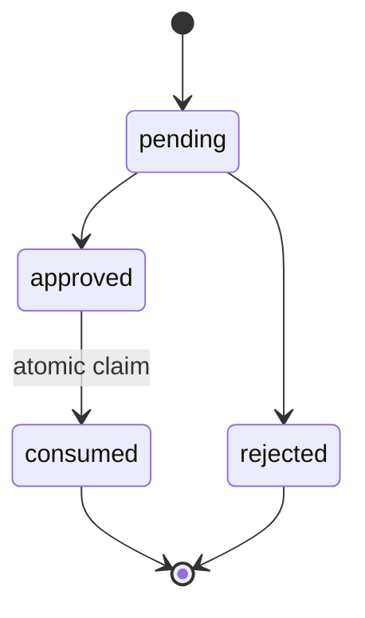

# 观心 v2 当前架构

> 版本：v2.1-persistent-workflow
>
> 日期：2026-08-20
> 状态：Implemented

## 1. 运行时结构

前端统一运行在 3000 端口，通过 Next.js rewrite 访问 8000 端口的后端。Assistant 只使用 `/api/agent/chat/aisdk`；历史 AG-UI 与自定义 SSE 端点已移除。

## 2. 数据职责

| 存储 | 数据 | 隔离方式 |
|---|---|---|
| SQLite | documents、chunks、conversations、messages、agent_configs、workflow_runs、workflow_steps、workflow_interrupts、workflow_step_executions、schema_version | tenant_id；会话与工作流再校验 user_id |
| Checkpoint SQLite | LangGraph 执行游标和 interrupt 状态 | run_id 同时作为 thread_id，恢复前先做业务归属校验 |
| ChromaDB | 文档向量 | 每租户独立 collection |
| users.json | 预设用户和 API Key | UserManager 校验 tenant_id |
| uploads | 原始上传文件 | SQLite 文档记录关联唯一 doc_id 路径 |

SQLite 每次操作创建独立连接，启用 WAL、foreign keys、5 秒 busy timeout；写事务使用 `BEGIN IMMEDIATE`，避免并发写锁升级失败。Schema 初始化版本化且幂等。

## 3. Assistant 链路

1. 前端创建服务端 conversation UUID，并将其作为 `useChat` id。
2. `DefaultChatTransport` 动态读取 Bearer token；无 token 时在发起网络请求前失败。
3. 后端验证 JWT/API Key，再按 tenant_id + user_id 校验会话；无权访问统一返回 404。
4. Agent 从当前租户 SQLite 配置读取模型、temperature、max_tokens、system prompt、工具、Skill 与 MCP 列表。
5. 内部事件带稳定 tool_call_id，并转换为 AI SDK text、reasoning、tool、approval 与 `data-a2ui` parts。
6. 消息 parts 原样持久化；刷新、切换会话或重启后直接恢复。

## 4. 持久化工作流

DeepSeek Planner 只获得当前租户 Agent 已启用并经 RBAC 过滤的工具定义，生成最多 16 步的线性计划。服务端校验工具、参数及 `$inputs.*` / `$steps.*` 引用；失败时只允许模型修复一次。计划通过后写入业务 SQLite，再由 LangGraph 逐步执行。

只读工具失败自动重试一次；写操作和 MCP 不自动重试。每次调用前先写 `executing` 和幂等键，重复恢复直接返回已保存结果。若进程在风险工具窗口退出，启动恢复只会将流程置为 `uncertain`，不会自动重放。

每个会话由部分唯一索引保证至多一个活动流程。删除会话会级联清理业务工作流记录，并删除对应 checkpoint thread。

## 5. Approval 状态机（旧记录兼容）

前端只调用 AI SDK `respondToApproval`；`sendAutomaticallyWhen` 在所有 approval 已响应后自动续发。后端从 approved 原子切换到 consumed 后才执行动作，重复请求无法再次领取同一 action。

新工作流使用 `workflow_interrupts` 与 AI SDK approval response；`tool_approvals` 只用于展示已有历史，不再承载新请求。

## 6. RBAC

| 能力 | user | admin |
|---|:---:|:---:|
| 本租户知识库上传/查询/删除 | ✓ | ✓ |
| 文本摘要、数据分析 | ✓ | ✓ |
| 读取 Agent 配置、调用已连接 MCP | ✓ | ✓ |
| 修改 Agent 配置 |  | ✓ |
| MCP 注册/删除/连接 |  | ✓ |
| 用户管理、数据导出、系统诊断 |  | ✓ |

授权同时存在于 API dependency、SkillExecutor 和 Agent 工具注册层。普通用户无法从 Agent 可用工具列表发现管理工具。

工作流在规划、执行和每次恢复前均重新过滤工具与鉴权。跨租户或跨用户查询统一返回 404；权限在等待期间被撤销时，恢复返回 403 且不会调用工具。

## 7. 文档写入一致性

上传顺序为：创建 SQLite 记录 → 保存文件 → 解析/切片 → 写 Chroma → READY。异常统一标记 FAILED，并按 chunk ID 补偿可能已写入的向量。删除前先验证租户；Chroma 删除失败则中止，成功后再删除文件和 SQLite 元数据。

## 8. 工程门槛

- 后端：`pytest -q`
- 前端：`npm run lint`
- 类型：`npx tsc --noEmit`
- 构建：`npm run build`
- 浏览器黄金路径：`npm run test:e2e`
- 本地启动：`./scripts/start.sh`

自动测试 mock LLM/Embedding/MCP，不调用真实付费模型。生产部署、分布式锁、条件分支、并行 DAG、审计日志、限流、远程 MCP SSE 和用户账户 SQLite 迁移不在当前版本范围。
